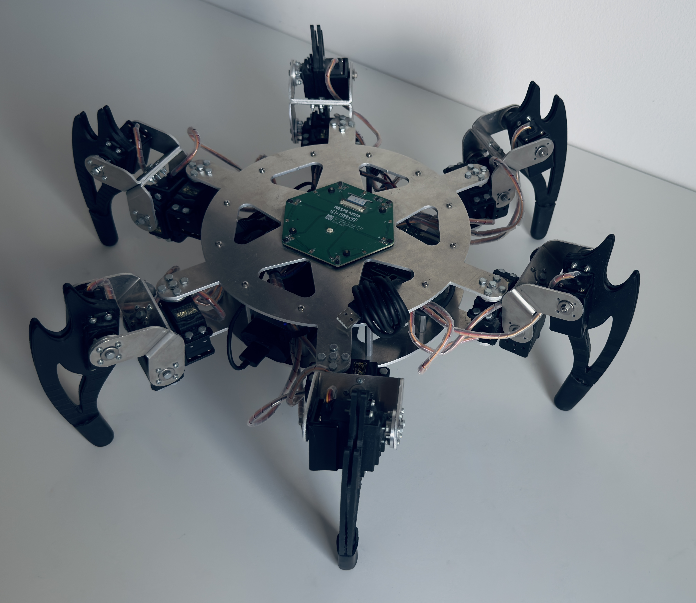
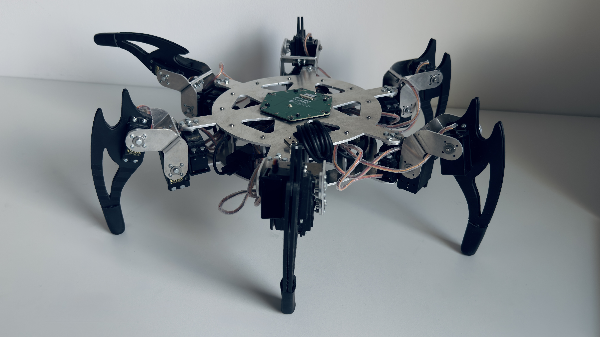

## Thesis : "Hexapod autonomous control system based on auditory scene analysis: real-time sound source localization and keyword spotting for voice command recognition"
--- In progress

Diploma project completed at Warsaw University of Science and Technology as a part of Master of Science in Engineering - Computer Science.

This project aims to develop an autonomous control system for a hexapod walking robot, using auditory scene analysis as the primary modality for navigation and environmental interaction. The system integrates sound source localization (Direction of Arrival estimation - DOA) and beamforming techniques via the ODAS framework, employing a circular microphone array for enhanced spatial precision. This enables the robot to accurately detect and characterize sound sources, allowing real-time responses to acoustic stimuli for dynamic, context-aware behavior.

A Keyword Spotting (KWS) module, powered by machine learning, is incorporated to recognize predefined voice commands, enabling effective human-robot interaction. The research focuses on developing the hardware and software infrastructure to seamlessly integrate acoustic processing with the robot's control system.

The project includes designing and building the robot's platform, encompassing both the mechanical structure and embedded systems. The hexapod's platform is engineered to support advanced auditory processing, ensuring optimal performance in real-world scenarios. This involves creating a robust mechanical framework for stable, agile locomotion and an embedded system architecture for real-time processing and decision-making.

The hardware is designed to accommodate the circular microphone array, ensuring precise sound capture, while the software facilitates seamless communication between auditory processing modules, the control system, and actuators. This comprehensive approach ensures the robot can perform complex tasks, such as navigating dynamic environments and responding accurately to auditory cues.





## Table of Contents
- [Key Features](#key-features)
- [Implementation Details](#implementation-details)
  - [Hardware Configuration](#hardware-configuration)
  - [Software Stack](#software-stack)
  - [Core Systems](#core-systems)
    - [Audio Processing Pipeline](#audio-processing-pipeline)
    - [Voice Control System](#voice-control-system)
    - [Movement Control](#movement-control)
  - [Project Structure](#project-structure)
  - [Build and Run](#build-and-run)
  - [Testing](#testing)

### Key Features

1. **Advanced Audio Processing**
   - Real-time Direction of Arrival (DOA) estimation using a 6-microphone circular array
   - Spatial audio processing through the ODAS framework
   - Beamforming for enhanced speech recognition in noisy environments
   - 16-direction spatial resolution for precise sound source tracking

2. **Intelligent Voice Control**
   - Custom wake word detection ("Hey Hexapod")
   - Natural language command processing using Picovoice's Rhino engine
   - Context-aware command interpretation
   - Real-time voice command execution

3. **Sophisticated Movement System**
   - 18-degree-of-freedom movement (3 DOF per leg)
   - Multiple gait patterns including tripod and wave gaits
   - Precise inverse kinematics for smooth motion
   - 50Hz servo update rate for fluid movement

4. **Hardware Integration**
   - High-performance Raspberry Pi 4 (2GB) for real-time processing
   - Professional-grade MG996R servos for reliable movement
   - Pololu Maestro controller for precise servo management
   - ReSpeaker 6-Mic array for spatial audio capture
   - IMU integration for movement stability
   - Visual feedback through WS2812B LED strip


## Implementation Details

### Hardware Configuration
- Raspberry Pi 4 (8GB) running Raspberry Pi OS
- 6x MG996R servo motors
- Pololu Maestro 24-Channel USB Servo Controller
- ReSpeaker 6-Mic Circular Array
- ICM-20948 IMU
- WS2812B LED strip (30 LEDs)
- 5V 10A power supply

### Software Stack
- Python 3.8+
- ODAS v1.0.0 for audio processing
- Picovoice Porcupine v2.1.3 for wake word detection
- Picovoice Rhino v2.1.1 for command recognition
- RPi.GPIO v0.7.1 for hardware control
- NumPy v2.1.2 for numerical computations

### Core Systems

#### Audio Processing Pipeline
The system implements a voice control pipeline with optional ODAS enhancement for spatial audio processing:

Primary Pipeline (Direct Microphone Input):
```
Microphone Input
    ↓
Picovoice Processing
    - Wake word detection (Porcupine)
    - Intent recognition (Rhino)
    - Command execution
```

Optional ODAS Enhancement:
```
Microphone Array (6 channels)
    ↓
ODAS Processing
    - Spatial filtering
    - Noise reduction
    - Echo cancellation
    - Channel selection
    ↓
DOA Estimation (16 directions)
    - Real-time direction tracking
    - Multiple source separation
    ↓
Beamforming
    - Adaptive beam steering
    - Signal enhancement
    ↓
Picovoice Processing
    - Wake word detection (Porcupine)
    - Intent recognition (Rhino)
    - Command execution
```

#### Voice Control System
The voice control system implements a sophisticated pipeline using Picovoice's engines for natural human-robot interaction:

1. **Wake Word Detection**
   - Custom wake word "Hey Hexapod" using Picovoice's Porcupine engine
   - Real-time audio stream processing via PvRecorder
   - Low-latency wake word detection (< 100ms)
   - Robust performance in noisy environments

2. **Command Recognition Pipeline**
   ```
   Audio Input (PvRecorder)
      ↓
   Picovoice Processing
      - Porcupine wake word detection
      - Rhino intent recognition
      - Natural language understanding
      ↓
   Intent Processing
      - Command validation
      - Parameter extraction
      - Context awareness
      ↓
   Action Execution
      - Command mapping to robot actions
      - Real-time execution
      - Status feedback
   ```

3. **Command Processing Features**
   - Support for multiple command types:
     - Movement commands (walk, turn, stop)
     - Gait control (change gait pattern, adjust speed)
     - System commands (calibrate, shutdown)
     - Status queries (battery, position)
   - Context-aware command interpretation
   - Parameter extraction from natural language
   - Real-time command execution with feedback
   - Error handling and recovery

4. **Performance Characteristics**
   - Command recognition accuracy: >95%
   - Processing latency: <200ms
   - Support for continuous command streaming
   - Robust to environmental noise
   - Adaptive to different speaking styles

5. **Optional ODAS Enhancement**
   - Enhanced spatial audio processing
   - Improved noise rejection
   - Direction of arrival estimation
   - Beamforming for better signal quality

#### Movement Control
The hexapod's movement system implements a state-based gait generator and inverse kinematics solver:

1. **State-Based Gait Generator**
   ```
   Gait Pattern Definition
      ↓
   State Machine
      - States: Leg phases (stance/swing)
      - Transitions: Predefined phase sequences
      - Stability: IMU-based monitoring
      ↓
   Gait Execution
      - Real-time state machine
      - Smooth phase transitions
      - Dynamic stability control
   ```

2. **Inverse Kinematics System**
   ```
   Target Position
      ↓
   IK Solver
      - 3-DOF per leg (coxa, femur, tibia)
      - Analytical solution using geometric approach
      - Joint limit validation
      - End effector offset compensation
      ↓
   Joint Angles
      - Coxa: Yaw rotation (horizontal plane)
      - Femur: Pitch rotation (vertical plane)
      - Tibia: Pitch rotation (vertical plane)
      ↓
   Motion Planning
      - Joint angle validation
      - Custom angle limits support
      - Angle inversion handling
      - Servo target mapping
   ```

   The inverse kinematics system implements:
   - Geometric approach using triangle relationships
   - End effector offset compensation
   - Maximum reach validation
   - Joint limit enforcement
   - Support for inverted joints
   - Custom angle limits per joint
   - Precise servo target mapping
3. **Gait Patterns**
   - **Tripod Gait**
     - Three legs in stance, three in swing
     - Maximum stability
     - Efficient forward motion
     - Diagonal support pattern
   
   - **Wave Gait**
     - Sequential leg movement
     - Precise positioning
     - Maximum stability
     - Slow but stable motion

   - **Custom Gaits**
     - Dynamic pattern generation
     - Adaptive to terrain
     - Energy optimization
     - Stability prioritization

4. **Movement Features**
   - Real-time gait adaptation
   - Dynamic stability control
   - Smooth trajectory planning
   - Collision prevention
   - Energy-efficient motion
   - Terrain adaptation
   - Fault tolerance


### Project Structure
The project is organized into several key directories, each serving a specific purpose:

```
├── src/                    # Main source code directory
│   ├── robot/             # Core movement control and kinematics
│   ├── kws/              # Voice recognition system
│   ├── odas/             # Spatial audio processing
│   ├── control/          # High-level system control
│   ├── imu/              # Motion and orientation sensing
│   ├── lights/           # LED control and visual feedback
│   ├── maestro/          # Pololu Maestro controller interface
│   ├── interface/        # User interface components
│   ├── utils/            # Utility functions and helpers
│   └── scripts/          # Maintenance and utility scripts
├── tests/                # Test suite
├── docs/                 # Documentation
├── assets/              # Project assets and resources
├── firmware/            # Firmware files
├── lib/                 # External libraries
├── logs/                # Log files
└── main.py             # Main application entry point
```

Each component is designed to be modular and maintainable:

- **robot/**: Implements the core movement control system, including gait patterns and inverse kinematics
- **kws/**: Contains the voice recognition system with wake word detection and command processing
- **odas/**: Handles spatial audio processing and sound source localization
- **control/**: Manages high-level system control and coordination
- **imu/**: Provides motion and orientation sensing capabilities
- **lights/**: Controls the LED strip for visual feedback
- **maestro/**: Interfaces with the Pololu Maestro servo controller
- **interface/**: Contains user interface components
- **utils/**: Houses utility functions and helper modules
- **scripts/**: Contains maintenance and utility scripts

The project follows a modular architecture that allows for easy maintenance and extension of functionality.

### Build and Run
```bash
# Install dependencies
pip install -r requirements.txt

# Run with ODAS
python main.py --access-key "YOUR_PICOVOICE_KEY" --use-odas

# Run without ODAS (direct mic input)
python main.py --access-key "YOUR_PICOVOICE_KEY"
```

### Testing
```bash
# Run all tests
pytest tests/

# Run specific test suite
pytest tests/test_robot.py
pytest tests/test_audio.py
pytest tests/test_imu.py
```

## License

Copyright (c) 2025 Krystian Głodek <krystian.glodek1717@gmail.com>. All rights reserved.
