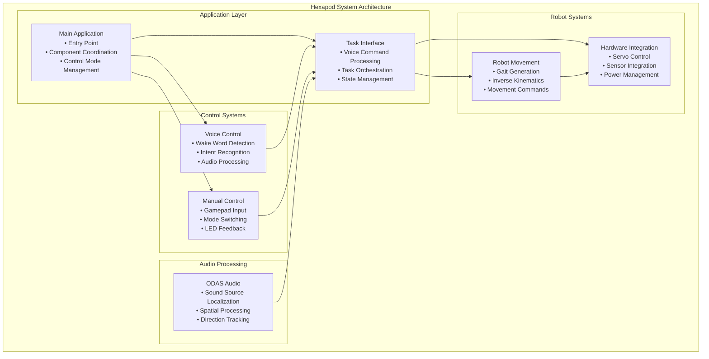
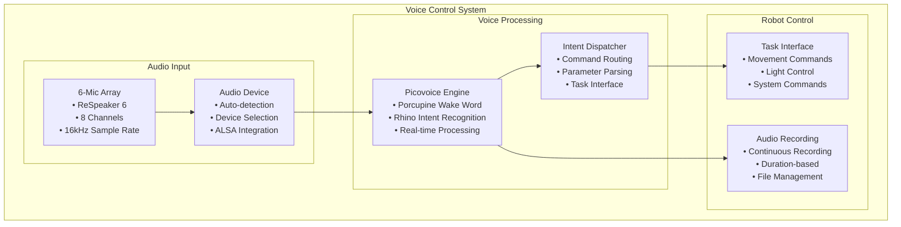
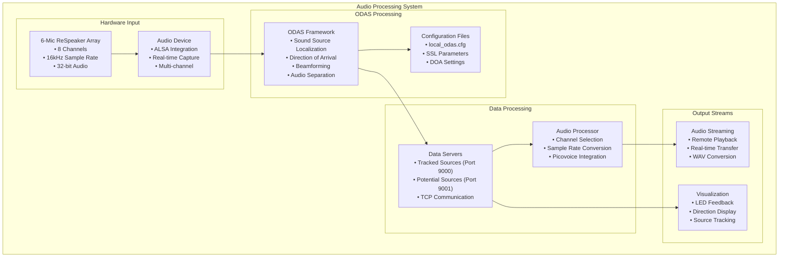
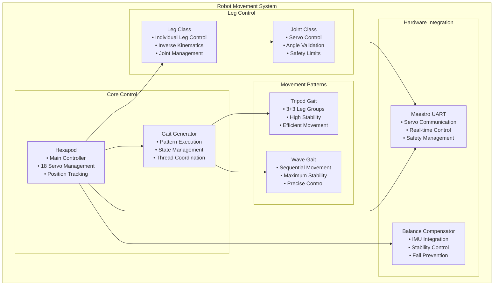
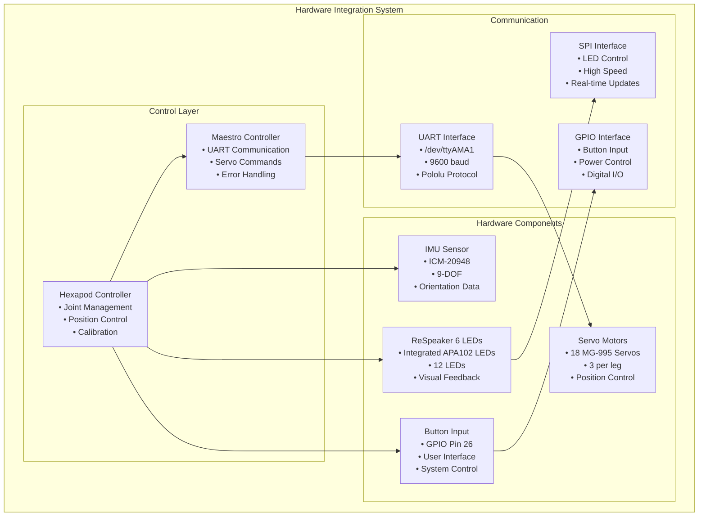
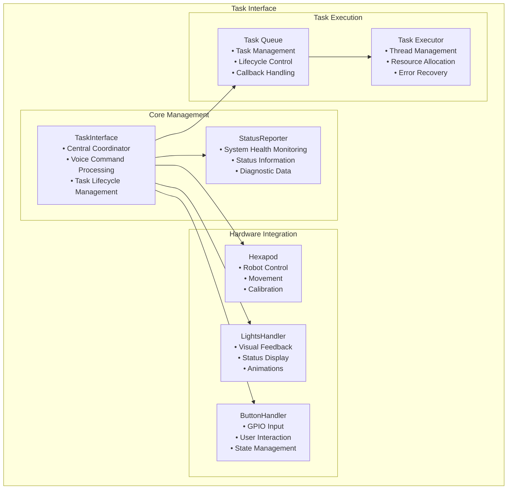

## Thesis : "Hexapod autonomous control system based on auditory scene analysis: real-time sound source localization and keyword spotting for voice command recognition"

Diploma project completed at Warsaw University of Science and Technology as a part of Master of Science in Engineering - Computer Science.

This project aims to develop an autonomous control system for a hexapod walking robot, using auditory scene analysis as the primary modality for navigation and environmental interaction. The system integrates sound source localization (Direction of Arrival estimation - DOA) and beamforming techniques via the ODAS framework, employing a circular microphone array for enhanced spatial precision. This enables the robot to accurately detect and characterize sound sources, allowing real-time responses to acoustic stimuli for dynamic, context-aware behavior.

A Keyword Spotting (KWS) module, powered by machine learning, is incorporated to recognize predefined voice commands, enabling effective human-robot interaction. The research focuses on developing the hardware and software infrastructure to seamlessly integrate acoustic processing with the robot's control system.

The project includes designing and building the robot's platform, encompassing both the mechanical structure and embedded systems. The hexapod's platform is engineered to support advanced auditory processing, ensuring optimal performance in real-world scenarios. This involves creating a robust mechanical framework for stable, agile locomotion and an embedded system architecture for real-time processing and decision-making.

The hardware is designed to accommodate the circular microphone array, ensuring precise sound capture, while the software facilitates seamless communication between auditory processing modules, the control system, and actuators. This comprehensive approach ensures the robot can perform complex tasks, such as navigating dynamic environments and responding accurately to auditory cues.


### Real-Time Sound Source Localization: Hexapod Robot with ODAS Audio Processing
[Click the image below to watch the full demonstration video]

[](https://www.youtube.com/watch?v=d-cn0CHzEGE)

This video demonstrates an autonomous hexapod robot performing advanced auditory scene analysis in real-time. The complete ODAS (Open embeddeD Audition System) pipeline with beamforming is showcased, featuring:

- Real-time Direction of Arrival (DoA) estimation using a 6-microphone circular array
- Live GUI visualization showing sound source tracking and spatial mapping
- Terminal debug output displaying active sound sources with coordinates and activity levels
- Elevation and azimuth time charts showing temporal tracking of sound source positions
- System monitoring panel showing CPU usage, temperature, memory usage, and IP address
- Robot view - top-down view of the hexapod responding to acoustic stimuli
- LED feedback system indicating detected sound sources through visual cues
- Multi-source tracking - demonstrating the system's ability to track up to 4 simultaneous sound sources
- Automatic audio stream separation and recording of individual source audio files

This represents a complete autonomous control system where the hexapod can navigate and interact based purely on auditory cues, enabling sophisticated human-robot interaction through voice commands and environmental sound awareness.

## Voice Control System

The hexapod operates through a sophisticated voice control system that processes commands through distinct phases, each with specific functionality and visual feedback:

### System Phases

#### 1. **Wake Word Detection Mode**

*"Listening for 'Hexapod'..."* - System continuously monitors audio input for the wake word using Picovoice Porcupine engine. LEDs show pulsing animation (blue base with green pulse) during passive listening state.

#### 2. **Intent Recognition Mode**

*"What would you like me to do?"* - After wake word detection, system switches to active command listening using Picovoice Rhino engine. LEDs show alternating light rotating pattern while waiting for voice command.

#### 3. **Command Processing Mode**

*"Processing your request..."* - System analyzes the recognized intent, extracts parameters, and determines the appropriate action. LED animation shows lime green opposite rotation pattern during processing.

#### 4. **Task Execution Mode**

*"Executing command..."* - System dispatches the command to the appropriate subsystem (movement, lights, audio, or system control). LED feedback varies by command type and execution progress.

#### 5. **Error Handling Mode**

*"Command not recognized"* - System handles unrecognized commands, invalid parameters, or execution failures. LED indicators show pulsing animation (red base with orange pulse) for error states.

### System Features
- **Multi-intent processing** - Handles complex commands with multiple parameters
- **Task interruption** - Wake word detection automatically interrupts current tasks (gait tasks are gracefully stopped after completing a cycle)
- **Real-time feedback** - Visual and audio confirmation of system state
- **Error recovery** - Graceful handling of command failures and system errors

## Usage Examples

### Movement Commands

#### Walk

*"Hexapod, walk [direction] [for X seconds/minutes/cycles]" - Omnidirectional movement in 8 directions: forward, backward, left, right, forward left, forward right, backward left, backward right. Supports time-based (seconds/minutes) or cycle-based movement*

#### Turn

*"Hexapod, turn [clockwise/counterclockwise] [for X seconds/minutes/cycles]" - Smooth rotation in both directions using inverse kinematics. Supports time-based (seconds/minutes) or cycle-based rotation*

#### March in Place

*"Hexapod, march in place [for X seconds/minutes]" - In-place marching demonstration with optional duration control*

#### Idle Stance
*"Hexapod, go to idle stance" - Return to neutral default position*

### Entertainment Commands

#### Sit Up

*"Hexapod, make some sit ups" - Dynamic sit-up exercise routine*

#### Say Hello

*"Hexapod, say hello" - Friendly greeting gesture with leg movement*

#### Show Off

*"Hexapod, show off" - Demonstration routine showcasing capabilities*

#### Helix

*"Hexapod, helix" - Complex helical movement pattern*

### Light Commands

#### Police Lights

*"Hexapod, activate police mode" - Police-style flashing lights*

#### Rainbow Lights

*"Hexapod, activate rainbow" - Rainbow color sequence*

#### Change Color

*"Hexapod, change color to [blue/red/green/etc.]" - Change LED color to specified color from 13 available colors*

#### Turn Lights On/Off

*"Hexapod, turn lights [on/off]" - Control LED power state*

#### Set Brightness

*"Hexapod, set brightness to X%" - Adjust LED brightness from 0-100%*

### Audio Commands

#### Sound Source Following

*"Hexapod, follow me" - Audio-based target following using ODAS*

#### Sound Source Localization

*"Hexapod, run sound source localization" - Analyze environment for sound sources*

#### Stream ODAS Audio
*"Hexapod, stream ODAS audio" - Stream processed audio from ODAS system to remote host*

#### Start/Stop Recording
*"Hexapod, start recording [for X seconds/minutes]" / "Hexapod, stop recording" - Begin/end audio recording with optional duration control*

### System Commands

#### Calibrate

*"Hexapod, calibrate servos" - Servo calibration and position setup*

#### System Status
*"Hexapod, what's your status?" - System health and status reporting*

#### Help
*"Hexapod, show commands" - Display list of available commands*

#### Wake Up

*"Hexapod, wake up" - Activate the system from sleep mode*

#### Sleep

*"Hexapod, go to sleep" - Put system into sleep mode*

#### Stop
*"Hexapod, stop" - Immediately stop current task or movement*

#### Repeat Last Command
*"Hexapod, repeat last command" - Execute the previous command again*

#### Set Speed
*"Hexapod, set speed to X%" - Adjust movement speed from 0-100%*

#### Set Acceleration
*"Hexapod, set acceleration to X%" - Adjust movement acceleration from 0-100%*

#### Shut Down

*"Hexapod, shut down" - Safely power down the entire system with countdown timer and LED indication*

## Key Features

### Advanced Voice Control
- Custom wake word detection ("Hexapod")
- Natural language command processing
- Multi-intent handling for complex command processing
   - Context-aware command interpretation
- Support for movement, gait control, and system commands

### Spatial Audio Processing
- Real-time Direction of Arrival (DOA) estimation
- 6-microphone circular array processing
- Multi-source tracking (up to 4 simultaneous sources)
- Beamforming for enhanced speech recognition
- Optional GUI on remote host for ODAS processing
- Real-time audio streaming and recording capabilities
- Network communication for remote processing
- Automatic audio source separation and tracking

### Intelligent Movement
   - 18-degree-of-freedom movement (3 DOF per leg)
- Multiple gait patterns (tripod, wave, custom)
- IMU-based stability control
- Circle-based targeting for direction-independent movement
- Precise inverse kinematics for accurate positioning
- State machine management for coordinated gait execution

### Visual Feedback
- LED strip integration for status indication
- Advanced LED animation system with multiple patterns
- Real-time sound source localization visualization through LED patterns
- Color-coded system status and error indication
- Brightness control and color customization (RGB based)

## Performance Characteristics

- **Voice Recognition**: >95% accuracy, <200ms latency
- **Sound Source Localization**: ±5° accuracy, real-time processing
- **Movement Control**: 50Hz servo update rate
- **Multi-source Tracking**: Up to 4 simultaneous sound sources

## Hardware

### Core Components
- **Raspberry Pi 4** (2GB+ RAM recommended)
- **18x TowerPro MG-995 Servos** (3 per leg)
- **Pololu Maestro 24-Channel Servo Controller**
- **ReSpeaker 6-Mic Circular Array**
- **ICM-20948 IMU**
- **APA102 LED Strip** (integrated in ReSpeaker)
- **5 x 1.2V 2500 mAh NiMH Battery Pack (6V total)**

### Optional Components
- **Remote ODAS  - GUI**
- **Gamepad Controller** (for manual control)

## Quick Start

### Installation
```bash
# Clone the repository
git clone <repository-url>
cd hexapod

# Run the automated installation script
./install.sh
```

The installation script will:
- Check Python version compatibility
- Install the hexapod package and dependencies
- Create configuration directories
- Prompt for your Picovoice Access Key
- Set up the configuration file automatically

### Running the System

#### Basic Voice Control
```bash
# Run with voice control (uses default config file)
hexapod
```

#### With Gamepad Control
The system automatically detects and uses a connected DualSense controller. If a controller is detected, the system will start in manual control mode with voice control as a secondary option. If no controller is detected, the system falls back to voice control mode only.

```bash
# Run with automatic controller detection
hexapod
```

#### Custom Configuration
```bash
# Use a custom picovoice access_key configuration file
hexapod --config /path/to/your/.picovoice.env

# Override the Picovoice access key
hexapod --access-key "YOUR_PICOVOICE_KEY"
```

### Configuration Options

For a complete list of available command-line options, run:

```bash
hexapod --help
```

The system uses a configuration file at `~/.config/hexapod/.picovoice.env` by default, which is automatically created during installation.

## System Architecture

The hexapod system consists of several integrated components:

- **Voice Control System** - Picovoice integration for wake word detection and command recognition
- **ODAS Audio Processing** - Real-time spatial audio processing and sound source localization
- **Robot Movement** - 18-DOF hexapod with inverse kinematics and multiple gait patterns
- **Hardware Integration** - Servo control, IMU sensing, and LED feedback systems
- **Task Management** - Central coordination system for complex operations

### High-Level System Architecture



### Voice Control System



### ODAS Audio Processing



### Robot Movement System



### Hardware Integration



### Task Management System



## Documentation

For detailed technical documentation and system architecture please refer to the [Documentation](./docs/README.md).

The documentation covers:

### Getting Started
- [Installation Guide](INSTALL.md) - Complete installation and setup instructions

### Core Systems
- [System Overview](docs/core/system_overview.md) - High-level architecture and component relationships
- [Main Application](docs/core/main_application.md) - Application entry point and component coordination
- [Configuration](docs/core/configuration.md) - System configuration and parameters

### Robot Movement
- [Movement System](docs/robot/movement_system.md) - Overview of movement capabilities
- [Kinematics](docs/robot/kinematics.md) - Inverse kinematics and coordinate systems
- [Gait System](docs/robot/gait_system.md) - Walking patterns and gait generation
- [Movement Commands](docs/robot/movement_commands.md) - High-level movement commands

### Hardware Integration
- [Hardware Integration](docs/hardware/hardware_integration.md) - Hardware components and integration
- [Servo Control](docs/hardware/servo_control.md) - Servo control system and protocols
- [Lights System](docs/hardware/lights_system.md) - LED control and visual feedback
- [IMU Data Format](docs/hardware/imu_data_format.md) - IMU sensor data and processing

### Interface Systems
- [Task Interface](docs/interface/task_interface.md) - Central task coordination and management
- [Voice Control Interface](docs/interface/voice_control_interface.md) - Voice control system interface
- [Gamepad Controller](docs/interface/gamepad_controller.md) - Gamepad control and input handling

### Voice Control & Audio
- [Voice Control System](docs/voice/voice_control_system.md) - Voice recognition and command processing
- [Audio Recording](docs/voice/audio_recording.md) - Audio recording utilities and management

### ODAS Audio Processing
- [ODAS Audio Processing](docs/odas/odas_audio_processing.md) - Multi-channel audio capture and spatial processing
- [ODAS Server](docs/odas/odas_server.md) - ODAS server setup and configuration
- [ODAS Data Format](docs/odas/odas_data_format.md) - Data formats and protocols
- [DOA SSL Processor](docs/odas/doa_ssl_processor.md) - Direction of arrival and sound source localization
- [ODAS Audio Playback](docs/odas/odas_audio_playback.md) - ODAS audio playback utilities
- [Streaming ODAS Audio Player](docs/odas/streaming_odas_audio_player.md) - Remote audio streaming

## License

Copyright (c) 2025 Krystian Głodek <krystian.glodek1717@gmail.com>. All rights reserved. 