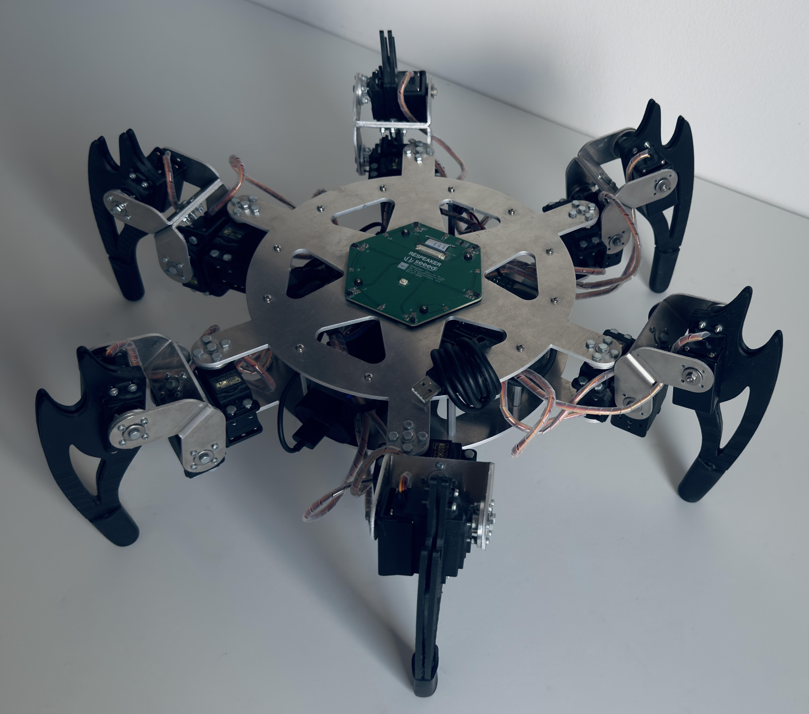

## Thesis : "Hexapod walking robot design and implementation of real-time gait generating algorithm"

Diploma project completed at AGH University of Krakow as part of the Bachelor of Science in Automatic Control and Robotics.
 
## Table of Contents

1. [Introduction](#introduction)
2. [Key Functionalities](#key-functionalities)
3. [Hexapod Robot Walking | Bachelor Project Showcase](#hexapod-robot-walking--bachelor-project-showcase)
4. [Brief Description](#brief-description)
5. [Mechanical Design](#mechanical-design)
6. [Electronics and Control Systems](#electronics-and-control-systems)
7. [Software](#software)
    - [Control Layer](#control-layer)
    - [Gait Generator](#gait-generator)
    - [Decision Layer - User Interface](#decision-layer---user-interface)
8. [Summary - Future Development](#summary---future-development)

### Introduction
The main objective of this project was to design and develop a six-legged walking robot as well as enabling the machine to realize real-time gait by developing and implementing a control system that includes a gait generator - an abstract module on software level, which task would be to synchronize actuators.

### Key functionalities:
- Walking on a flat surface
- Configurable movement parameters - type of gait, direction, speed
- Unsophistacted assembly and disassembly of the machine
- Modularity of the system
- Remote control 

### Hexapod Robot Walking | Bachelor Project Showcase

### Brief description

The thesis contained a description of theoretical issues concerning the broad research area of mobile walking robots. Issues included in the document cover in-depth specification of a system which is the walking machine created during the implementation of the project. 

Particular components of the robot were made using 3D printing technology. Detachable, threaded connections of components were used due to strength and simplicity of assembly/disassembly. Increasing the coefficient of friction of legs’ ends was achieved with rubber caps.

The constructed walking robot carries out an electrically driven, statically stable gait, which is remotely controlled by the user from a host computer.  The motion can be executed along the axis of the crab - it is possible to change the direction vector of the of movement at any time. 

Implemented control system allows elimination of interference arising in response to the environment, resulting in the preservation of permissible deviations of the actual trajectory. The implementation of gait generator is based on geometric relationships present in the machine's design and the module performs inverse kinematics calculations. The motion algorithm is designed to the extent to which the machine can efficiently move on a flat surface. 

Below - hexapod with the diploma :D

## Mechanical Design

- The robot's components were manufactured using additive technology, i.e., based on a digital model – 3D printing.
- One of the design assumptions is the dual bearing arrangement of the drives.
- etachable threaded connections were used for the components due to their strength and the simplicity of assembly/disassembly.
- The friction coefficient of the leg tips was increased using rubber covers.
- A key factor determining the design of the walking robot is the number of legs. The robot is equipped with six legs. This number represents a compromise between the cost of constructing the robot and the complexity of the control system that ensures static stability.

Figure 1: The robot's walking leg described in Euclidean space.

Figure 3: 3D model of the six-legged walking robot in SOLIDWORKS 2021.

Figure 4: 3D model of the legs in PrusaSlicer 2.5.0 prepared for 3D printing.

Figure 5: Constructed six-legged walking robot.

## Electronics and Control Systems

- The movement of the platform is driven by 18 standard feedback servomechanisms.
- The chosen control unit for this project is an embedded platform based on ARM architecture Raspberry Pi 4B.
- A secondary control unit will be a 24-channel servo driver (hardware PWM signal generation)..

## Software

- The entire higher-level control software will be implemented in Python, a multi-paradigm programming language, primarily due to its simplicity, object-orientation, and scripting nature.
- An algorithm has been developed to generate control signals for the servomechanisms according to a specified point in the leg tip's space – inverse kinematics.
- Additionally, a main control algorithm will be developed to determine the position of the robot's central point based on the positions of all six legs and calculate the gait parameters accordingly – inverse kinematics.
- One of the main assumptions is the use of hierarchical software architecture, separating layers of abstraction:

#### Control layer

- Position control of the servomechanism horn
- Setting the rotation speed of the servomechanism
- Reading data from analog and digital inputs
- Setting logical values on I/O outputs
- Sending feedback to the main control unit

#### Gait generator

- Inverse kinematics calculations
- Calculations to determine the central point of the walking robot
- Maintaining static stability based on the current position of the central body point – PID regulator
- Calculations related to the Kalman filter
- Gait generation based on user configuration and sensor data
- Sending execution commands to the auxiliary control unit
- Data acquisition
- Remote feedback transmission to the host computer

#### Decision layer - User interface

- Configuration of the walking robot (gait type, speed, direction)
- Remote transmission of control commands and receiving data from the onboard unit
- Displaying received feedback in the command line

### Summary - Future Development

The developed prototype has a wide scope of possible improvements in the future due to its high modularity:
- Inertial navigation system - maintaining spatial orientation, determining position and velocity by measuring accelerations and angular - Adaptation and maneuverability in varied (uneven) terrain
- Autonomy of overcoming obstacles
- Voice control of the walking robot
- Data acquisition in a time-series database
- Graphical user interface
- Software implementation using the Robot Operating System framework
