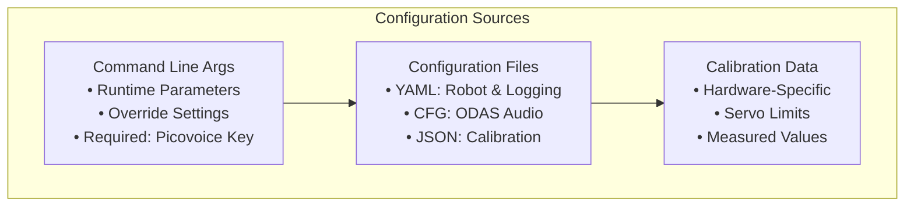
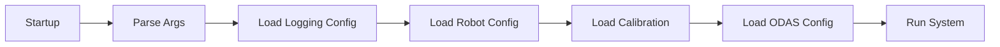

# Configuration

[← Previous: Main Application](main_application.md) | [Next: Movement System →](../robot/movement_system.md)

[← Back to Documentation](../README.md)

## Table of Contents

- [Overview](#overview)
- [Configuration Architecture](#configuration-architecture)
- [Command Line Configuration](#command-line-configuration)
- [Logging Configuration](#logging-configuration)
- [Robot Configuration](#robot-configuration)
- [ODAS Configuration](#odas-configuration)
- [Calibration Data](#calibration-data)
---

## Overview

The Hexapod system uses a simple but effective configuration approach with three main sources:

1. **Command Line Arguments** - Runtime parameters and overrides
2. **Configuration Files** - Persistent settings for different components
3. **Calibration Data** - Hardware-specific calibration values

The system loads configuration at startup and uses it throughout operation. There's no complex configuration management system - each component loads its own configuration directly from files.

## Configuration Architecture

### Configuration Sources



### Configuration Loading Flow



## Command Line Configuration

### Required Parameters

```bash
--access-key "YOUR_PICOVOICE_KEY"
```

### Optional Parameters

```bash
# Audio Configuration
--audio-device-index 2                    # Specific audio device
--audio-device-index -1                   # Auto-select device (default)

# Logging Configuration
--log-dir /path/to/logs                   # Log directory (default: logs)
--log-config-file config.yaml             # Log config file
--log-level DEBUG                         # Log level: DEBUG, INFO, WARNING, ERROR, CRITICAL, USER_INFO, ODAS_USER_INFO, GAMEPAD_MODE_INFO
--clean                                   # Clean existing logs

# Debug Options
--print-context                           # Show voice context information
```

### Usage Examples

```bash
# Basic operation
python main.py --access-key "KEY123"

# Debug mode with custom logging
python main.py --access-key "KEY123" \
    --log-level DEBUG \
    --log-dir /tmp/hexapod_logs \
    --print-context

# Clean logs and start fresh
python main.py --access-key "KEY123" --clean
```

## Logging Configuration

### Configuration File

**Location**: `src/interface/logging/config/config.yaml`

### Log Levels

- **DEBUG**: Detailed debugging information
- **INFO**: General operational messages
- **USER_INFO**: User-facing information messages (custom level 25)
- **ODAS_USER_INFO**: ODAS-specific user messages (custom level 26)
- **GAMEPAD_MODE_INFO**: Gamepad mode information (custom level 27)
- **WARNING**: Warning messages for potential issues
- **ERROR**: Error messages for failed operations
- **CRITICAL**: Critical system failures

### Log Categories

- **Main Application**: System startup and coordination
- **Task Interface**: Task execution and management
- **Voice Control**: Audio processing and recognition
- **Robot Control**: Movement and hardware control
- **Hardware**: Sensor and actuator operations
- **ODAS**: Audio processing and sound source localization
- **Lights**: LED control and visual feedback
- **Maestro**: Servo control operations

### Log Output

- **Console**: Colored output with USER_INFO level and above
- **Files**: Separate log files for each component with DEBUG level
- **Rotation**: 10MB max file size, 5 backup files per component

## Robot Configuration

### Configuration File

**Location**: `src/robot/config/hexapod_config.yaml`

### Key Parameters

#### Geometry
- `hexagon_side_length`: Distance between leg coxa joints (137.0 mm)

#### Controller Settings
- `controller.port`: Serial port for Maestro UART ("/dev/ttyAMA1")
- `controller.baudrate`: Communication speed (9600)

#### Servo Settings
- `speed`: Default speed percentage (25%)
- `accel`: Default acceleration percentage (20%)

#### Joint Parameters
- `coxa_params`: Coxa joint configuration (length, angles, limits)
- `femur_params`: Femur joint configuration (length, angles, invert)
- `tibia_params`: Tibia joint configuration (length, angles, limits)

#### Channel Mappings
- `coxa_channel_map`: Servo channels for coxa joints [0, 3, 6, 15, 18, 21]
- `femur_channel_map`: Servo channels for femur joints [1, 4, 7, 16, 19, 22]
- `tibia_channel_map`: Servo channels for tibia joints [2, 5, 8, 17, 20, 23]

#### LED Mappings
- `leg_to_led`: Maps leg indices to LED indices on the strip

#### Predefined Positions
- `predefined_positions`: Ready-to-use leg positions (zero, high_profile, low_profile)
- `predefined_angle_positions`: Ready-to-use joint angles

#### Gait Parameters
- `gait.translation`: Walking movement parameters
- `gait.rotation`: Turning movement parameters

## ODAS Configuration

### Configuration Files

**Location**: `src/odas/config/`

#### Configuration Files
- `local_odas.cfg`: Local audio processing settings
- `remote_odas.cfg`: Remote audio processing settings  
- `gui_xerolinux_remote_odas.cfg`: GUI-specific remote settings

### Audio Input Configuration

#### Raw Audio Settings
- **Sample Rate**: 16000 Hz
- **Channels**: 8 (ReSpeaker 6 Mic Array)
- **Bit Depth**: 32-bit
- **Hop Size**: 128 samples
- **Frame Size**: 256 samples
- **Sound Card**: Card 3, Device 0
- **Microphone Mapping**: Channels 1-6 (6 microphones)

#### Microphone Array Geometry
- **Array Type**: Circular, R = 0.0463m
- **Microphone Positions**: 6 microphones in circular pattern
- **Spatial Filters**: 80-90° elevation range
- **Direction**: Upward pointing (+Z direction)

### Network Configuration

#### Local Mode
- **IP Address**: `127.0.0.1` (localhost)
- **Potential Sources Port**: `9001`
- **Tracked Sources Port**: `9000`

#### Remote Mode
- **IP Address**: `192.168.0.171` (configurable)
- **Potential Sources Port**: `9001`
- **Tracked Sources Port**: `9000`

### Sound Source Localization (SSL)

#### Detection Parameters
- **Potential Sources**: 2-4 sources (local vs remote)
- **Matches**: 5-10 matches
- **Probability Minimum**: 0.7 (local) / 0.15 (remote)
- **Scan Levels**: 2 and 4 resolution levels
- **Output Format**: JSON over socket

### Sound Source Tracking (SST)

#### Filter Configuration
- **Mode**: "kalman" or "particle" filter
- **Add Mode**: "dynamic" source addition
- **Active Parameters**: Weight, mu, sigma2 values
- **Inactive Parameters**: Weight, mu, sigma2 values

#### Tracking Parameters
- **Probabilities**: Pfalse, Pnew, Ptrack
- **Kalman Filter**: sigmaQ parameter
- **Particle Filter**: nParticles, alpha/beta parameters

### Sound Source Separation (SSS)

#### Separation Algorithms
- **Separation Mode**: "dds", "dgss", or "dmvdr"
- **Post-filtering Mode**: "ms" (multichannel spectral subtraction)
- **Gain Settings**: Separation and post-filtering gains

#### Output Configuration
- **Separated Audio**: `data/audio/odas/separated.raw`
- **Post-filtered Audio**: `data/audio/odas/postfiltered.raw`
- **Output Format**: 44100 Hz, 16-bit, 512 hop size

### Classification

#### Analysis Parameters
- **Frame Size**: 1024 samples
- **Window Size**: 3 frames
- **Tau Range**: 32-200 samples
- **Alpha/Gamma**: Classification parameters
- **Output**: Currently disabled (blackhole)
- Audio classification parameters

## Calibration Data

### Configuration File

**Location**: `src/robot/config/calibration.json`

### Structure

```json
{
  "leg_0": {
    "coxa": {
      "servo_min": 3968,
      "servo_max": 8000
    },
    "femur": {
      "servo_min": 4080,
      "servo_max": 8000
    },
    "tibia": {
      "servo_min": 3968,
      "servo_max": 7920
    }
  }
}
```

### Purpose

- **Hardware-Specific**: Each servo has unique min/max values
- **Measured Values**: Calibrated through physical testing
- **Per-Leg Configuration**: Different values for each of the 6 legs
- **Per-Joint Configuration**: Different values for coxa, femur, tibia joints
---

[← Previous: Main Application](main_application.md) | [Next: Movement System →](../robot/movement_system.md)

[← Back to Documentation](../README.md)

