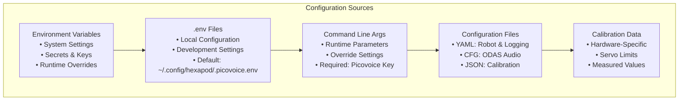

# Configuration

[← Previous: Main Application](main_application.md) | [Next: Movement System →](../robot/movement_system.md)

[← Back to Documentation](../README.md)

## Table of Contents

- [Overview](#overview)
- [Configuration Architecture](#configuration-architecture)
- [Environment Configuration](#environment-configuration)
- [Command Line Configuration](#command-line-configuration)
- [Logging Configuration](#logging-configuration)
- [Robot Configuration](#robot-configuration)
- [ODAS Configuration](#odas-configuration)
- [Calibration Data](#calibration-data)
- [Dependencies](#dependencies)
---

## Overview

The Hexapod system uses a modern configuration approach with multiple sources and a centralized configuration manager:

1. **Environment Variables** - System-wide settings and secrets
2. **Configuration Files** - Persistent settings for different components
3. **Command Line Arguments** - Runtime parameters and overrides
4. **Calibration Data** - Hardware-specific calibration values

The system features a centralized `Config` class that manages all configuration sources with proper validation and fallback mechanisms. Configuration is loaded at startup and used throughout operation with support for environment variables, `.env` files, and command line overrides.

## Configuration Architecture

### Configuration Sources



### Configuration Loading Flow


### Configuration Manager

The system uses a centralized `Config` class (`hexapod/config.py`) that:

- **Loads Environment Variables**: From system environment and `.env` files
- **Validates Configuration**: Ensures required settings are present
- **Provides Fallbacks**: Command line args override environment variables
- **Manages Secrets**: Handles Picovoice access keys securely
- **Supports Multiple Sources**: Environment → .env file → Command line

## Environment Configuration

### Environment Variables

The system supports configuration through environment variables with the following priority:

1. **Command Line Arguments** (highest priority)
2. **Environment Variables** (system-wide)
3. **.env Files** (local configuration)

### Required Environment Variables

```bash
# Picovoice Access Key (required)
export PICOVOICE_ACCESS_KEY="your_picovoice_key_here"
```

### Optional Environment Variables

```bash
# Logging Configuration
export HEXAPOD_LOG_LEVEL="INFO"
export HEXAPOD_LOG_DIR="/path/to/logs"

# Audio Configuration
export HEXAPOD_AUDIO_DEVICE_INDEX="-1"  # Auto-detect
```

### .env File Configuration

Create a `.env` file in your home directory or project root:

**Default Location**: `~/.config/hexapod/.picovoice.env`

**Example .env file**:
```bash
# Picovoice Configuration
PICOVOICE_ACCESS_KEY=your_picovoice_key_here

# Logging Configuration
HEXAPOD_LOG_LEVEL=INFO
HEXAPOD_LOG_DIR=/home/pi/hexapod_logs

# Audio Configuration
HEXAPOD_AUDIO_DEVICE_INDEX=-1
```

### Environment Setup

The system automatically loads environment variables from:

1. **System Environment**: Variables set in your shell
2. **.env File**: Located at `~/.config/hexapod/.picovoice.env` by default
3. **Local .env**: `.env` file in the current working directory

## Command Line Configuration

### Required Parameters

```bash
--access-key "YOUR_PICOVOICE_KEY"         # Picovoice access key (can also be set via PICOVOICE_ACCESS_KEY env var)
```

### Optional Parameters

```bash
# Configuration File
--config /path/to/.env                    # Path to .env configuration file (default: ~/.config/hexapod/.picovoice.env)

# Logging Configuration
--log-dir /path/to/logs                   # Log directory (default: logs)
--log-config-file config.yaml             # Log config file (default: hexapod/interface/logging/config/config.yaml)
--log-level DEBUG                         # Log level: DEBUG, INFO, USER_INFO, ODAS_USER_INFO, GAMEPAD_MODE_INFO, WARNING, ERROR, CRITICAL

# Utility Options
--clean                                   # Clean existing logs before starting
--print-context                           # Show voice context information
```

### Usage Examples

```bash
# Basic operation (using environment variable)
export PICOVOICE_ACCESS_KEY="KEY123"
hexapod

# Basic operation (using command line)
hexapod --access-key "KEY123"

# Using custom .env file
hexapod --config /path/to/custom/.env

# Debug mode with custom logging
hexapod --access-key "KEY123" \
    --log-level DEBUG \
    --log-dir /tmp/hexapod_logs \
    --print-context

# Clean logs and start fresh
hexapod --access-key "KEY123" --clean

# Using environment variable with overrides
export PICOVOICE_ACCESS_KEY="KEY123"
hexapod --log-level USER_INFO --print-context
```

### Configuration Priority

1. **Command Line Arguments** (highest priority)
2. **Environment Variables** (system-wide)
3. **.env File** (local configuration)
4. **Default Values** (lowest priority)

## Logging Configuration

### Configuration File

**Location**: `hexapod/interface/logging/config/config.yaml`

### Log Levels

- **DEBUG**: Detailed debugging information
- **INFO**: General operational messages
- **USER_INFO**: User-facing information messages (custom level 25)
- **ODAS_USER_INFO**: ODAS-specific user messages (custom level 26)
- **GAMEPAD_MODE_INFO**: Gamepad mode information (custom level 27)
- **WARNING**: Warning messages for potential issues
- **ERROR**: Error messages for failed operations
- **CRITICAL**: Critical system failures

### Log Categories

- **Main Application**: System startup and coordination
- **Task Interface**: Task execution and management
- **Voice Control**: Audio processing and recognition
- **Robot Control**: Movement and hardware control
- **Hardware**: Sensor and actuator operations
- **ODAS**: Audio processing and sound source localization
- **Lights**: LED control and visual feedback
- **Maestro**: Servo control operations

### Log Output

- **Console**: Colored output with USER_INFO level and above
- **Files**: Separate log files for each component with DEBUG level
- **Rotation**: 10MB max file size, 5 backup files per component

## Robot Configuration

### Configuration File

**Location**: `hexapod/robot/config/hexapod_config.yaml`

### Key Parameters

#### Geometry
- `hexagon_side_length`: Distance between leg coxa joints (137.0 mm)

#### Controller Settings
- `controller.port`: Serial port for Maestro UART ("/dev/ttyAMA1")
- `controller.baudrate`: Communication speed (9600)

#### Servo Settings
- `speed`: Default speed percentage (25%)
- `accel`: Default acceleration percentage (20%)

#### Joint Parameters
- `coxa_params`: Coxa joint configuration (length, angles, limits)
- `femur_params`: Femur joint configuration (length, angles, invert)
- `tibia_params`: Tibia joint configuration (length, angles, limits)

#### Channel Mappings
- `coxa_channel_map`: Servo channels for coxa joints [0, 3, 6, 15, 18, 21]
- `femur_channel_map`: Servo channels for femur joints [1, 4, 7, 16, 19, 22]
- `tibia_channel_map`: Servo channels for tibia joints [2, 5, 8, 17, 20, 23]

#### LED Mappings
- `leg_to_led`: Maps leg indices to LED indices on the strip

#### Predefined Positions
- `predefined_positions`: Ready-to-use leg positions (zero, high_profile, low_profile)
- `predefined_angle_positions`: Ready-to-use joint angles

#### Gait Parameters
- `gait.translation`: Walking movement parameters
- `gait.rotation`: Turning movement parameters

## ODAS Configuration

### Configuration Files

**Location**: `hexapod/odas/config/`

#### Configuration Files
- `local_odas.cfg`: Local audio processing settings
- `remote_odas.cfg`: Remote audio processing settings  
- `gui_xerolinux_remote_odas.cfg`: GUI-specific remote settings

### Audio Input Configuration

#### Raw Audio Settings
- **Sample Rate**: 16000 Hz
- **Channels**: 8 (ReSpeaker 6 Mic Array)
- **Bit Depth**: 32-bit
- **Hop Size**: 128 samples
- **Frame Size**: 256 samples
- **Sound Card**: Card 3, Device 0
- **Microphone Mapping**: Channels 1-6 (6 microphones)

#### Microphone Array Geometry
- **Array Type**: Circular, R = 0.0463m
- **Microphone Positions**: 6 microphones in circular pattern
- **Spatial Filters**: 80-90° elevation range
- **Direction**: Upward pointing (+Z direction)

### Network Configuration

#### Local Mode
- **IP Address**: `127.0.0.1` (localhost)
- **Potential Sources Port**: `9001`
- **Tracked Sources Port**: `9000`

#### Remote Mode
- **IP Address**: `192.168.0.171` (configurable)
- **Potential Sources Port**: `9001`
- **Tracked Sources Port**: `9000`

### Sound Source Localization (SSL)

#### Detection Parameters
- **Potential Sources**: 2-4 sources (local vs remote)
- **Matches**: 5-10 matches
- **Probability Minimum**: 0.7 (local) / 0.15 (remote)
- **Scan Levels**: 2 and 4 resolution levels
- **Output Format**: JSON over socket

### Sound Source Tracking (SST)

#### Filter Configuration
- **Mode**: "kalman" or "particle" filter
- **Add Mode**: "dynamic" source addition
- **Active Parameters**: Weight, mu, sigma2 values
- **Inactive Parameters**: Weight, mu, sigma2 values

#### Tracking Parameters
- **Probabilities**: Pfalse, Pnew, Ptrack
- **Kalman Filter**: sigmaQ parameter
- **Particle Filter**: nParticles, alpha/beta parameters

### Sound Source Separation (SSS)

#### Separation Algorithms
- **Separation Mode**: "dds", "dgss", or "dmvdr"
- **Post-filtering Mode**: "ms" (multichannel spectral subtraction)
- **Gain Settings**: Separation and post-filtering gains

#### Output Configuration
- **Separated Audio**: `data/audio/odas/separated.raw`
- **Post-filtered Audio**: `data/audio/odas/postfiltered.raw`
- **Output Format**: 44100 Hz, 16-bit, 512 hop size

### Classification

#### Analysis Parameters
- **Frame Size**: 1024 samples
- **Window Size**: 3 frames
- **Tau Range**: 32-200 samples
- **Alpha/Gamma**: Classification parameters
- **Output**: Currently disabled (blackhole)
- Audio classification parameters

## Calibration Data

### Configuration File

**Location**: `hexapod/robot/config/calibration.json`

### Structure

```json
{
  "leg_0": {
    "coxa": {
      "servo_min": 3968,
      "servo_max": 8000
    },
    "femur": {
      "servo_min": 4080,
      "servo_max": 8000
    },
    "tibia": {
      "servo_min": 3968,
      "servo_max": 7920
    }
  }
}
```

### Purpose

- **Hardware-Specific**: Each servo has unique min/max values
- **Measured Values**: Calibrated through physical testing
- **Per-Leg Configuration**: Different values for each of the 6 legs
- **Per-Joint Configuration**: Different values for coxa, femur, tibia joints

## Dependencies

### Python Dependencies

The system requires Python 3.12+ and the following packages (managed via `pyproject.toml`):

#### Core Dependencies
- **picovoice==3.0.4**: Voice recognition and wake word detection
- **pvporcupine==3.0.3**: Wake word detection engine
- **pvrhino==3.0.3**: Speech-to-intent engine
- **numpy==2.3.1**: Numerical computing
- **PyYAML==6.0.2**: YAML configuration file parsing
- **python-dotenv==1.0.0**: Environment variable management

#### Hardware Dependencies
- **RPi.GPIO==0.7.1**: Raspberry Pi GPIO control
- **gpiozero==2.0.1**: High-level GPIO interface
- **pyserial==3.5**: Serial communication with Maestro
- **smbus2==0.5.0**: I2C communication for sensors
- **spidev==3.7**: SPI communication for LED strips
- **icm20948==1.0.0**: IMU sensor interface

#### Audio Dependencies
- **PyAudio==0.2.14**: Audio input/output
- **pygame==2.6.1**: Audio playback and gamepad support

#### Utility Dependencies
- **colorzero==2.0**: Color manipulation for LEDs
- **cryptography==45.0.5**: Security and encryption
- **paramiko==3.5.1**: SSH communication
- **bcrypt==4.3.0**: Password hashing

### Installation

Dependencies are automatically installed when setting up the project:

```bash
# Install from requirements.txt
pip install -r requirements.txt

# Or install as a package
pip install -e .
```

### Configuration Files

The system includes several configuration files that are automatically packaged:

- **Logging Config**: `hexapod/interface/logging/config/*.yaml`
- **Robot Config**: `hexapod/robot/config/*.yaml` and `*.json`
- **ODAS Config**: `hexapod/odas/config/*.cfg`
- **Voice Models**: `hexapod/kws/porcupine/*.ppn` and `hexapod/kws/rhino/*.rhn`

### Environment Setup

The system supports multiple configuration methods:

1. **Environment Variables**: Set system-wide configuration
2. **.env Files**: Local configuration files
3. **Command Line**: Runtime parameter overrides
4. **Configuration Files**: Component-specific settings

---

[← Previous: Main Application](main_application.md) | [Next: Movement System →](../robot/movement_system.md)

[← Back to Documentation](../README.md)

