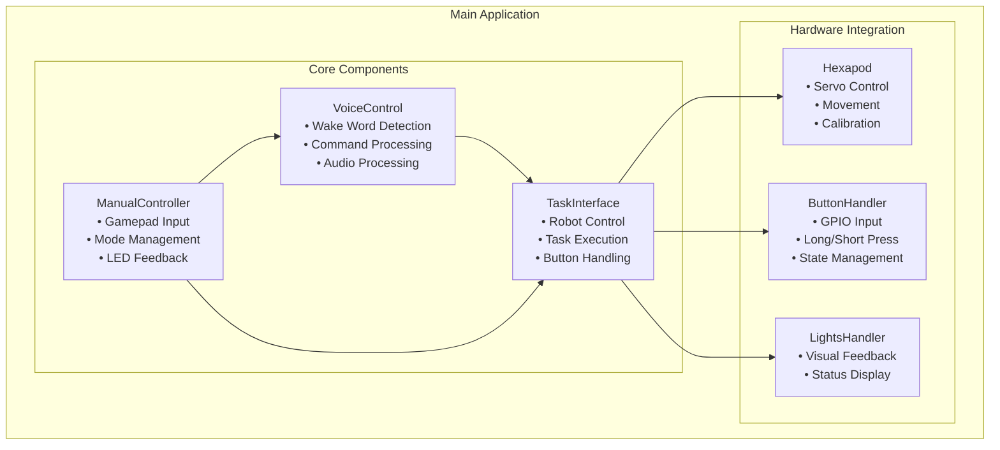
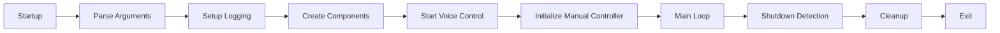
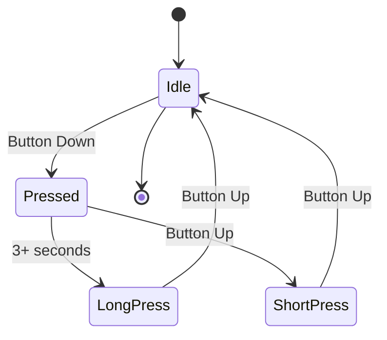
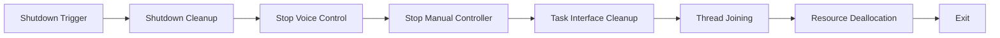

# Main Application

[← Previous: System Overview](system_overview.md) | [Next: Configuration →](configuration.md)

[← Back to Documentation](../README.md)

## Table of Contents

- [Overview](#overview)
- [Architecture](#architecture)
- [Application Flow](#application-flow)
- [Component Management](#component-management)
- [Control Modes](#control-modes)
- [Button Interactions](#button-interactions)
- [Shutdown Management](#shutdown-management)
- [Error Handling](#error-handling)
- [Configuration](#configuration)

---

## Overview

The main application (`main.py`) is the entry point for the hexapod system. It coordinates between voice control, manual control (gamepad), and the task interface to provide a unified control system for the robot.

The application supports two primary control modes:
- **Voice Control Mode**: Primary interaction through voice commands with button support
- **Manual Control Mode**: Gamepad-based control with voice control as secondary option

## Architecture

### Application Components

### Application Flow

## Application Flow

### 1. Startup Sequence

1. **Command Line Parsing**: Parse arguments for configuration
2. **Logging Setup**: Initialize logging system with specified level
3. **Component Creation**: Create TaskInterface and VoiceControl
4. **Voice Control Start**: Start voice control thread
5. **Manual Controller**: Initialize gamepad controller (optional)
6. **Main Loop**: Enter main application loop

### 2. Main Loop Operation

The main loop continuously:
- Monitors for shutdown events
- Handles button interactions
- Coordinates between control modes
- Manages component state

### 3. Shutdown Sequence

1. **Shutdown Detection**: PS5 button or KeyboardInterrupt
2. **Component Cleanup**: Stop all threads and components
3. **Resource Deallocation**: Clean up hardware resources
4. **Thread Joining**: Wait for all threads to complete
5. **Exit**: Terminate application

## Component Management

### TaskInterface

**Role**: Central coordination hub
- Manages robot control and movement
- Handles task execution and queuing
- Processes button interactions
- Coordinates between voice and manual control

**Key Features**:
- Voice control pause/resume management
- Task execution with blocking prevention
- Button interaction processing
- System state management

### VoiceControl

**Role**: Voice command processing
- Wake word detection (Porcupine)
- Command recognition (Rhino)
- Audio processing and streaming
- Context management

**Key Features**:
- Real-time audio processing
- Natural language understanding
- Command execution through TaskInterface
- Context-aware responses

### ManualController (Gamepad)

**Role**: Gamepad-based control
- Input processing and mapping
- Mode switching (Body/Gait/Voice)
- LED feedback for status
- Shutdown coordination

**Key Features**:
- DualSense controller support
- Multiple control modes
- Visual feedback through LEDs
- Seamless mode switching

## Control Modes

### Voice Control Mode

**Primary Interface**: Voice commands
**Secondary Interface**: Button interactions
**Features**:
- Wake word activation
- Natural language commands
- Task execution and control
- System state management

**Button Actions**:
- **Short Press**: Toggle system on/off
- **Long Press**: Sound source localization
- **During Task**: Stop current task

### Manual Control Mode

**Primary Interface**: Gamepad
**Secondary Interface**: Voice commands
**Modes**:
- **Body Control**: Direct body movement via inverse kinematics
- **Gait Control**: Walking and turning via gait generator
- **Voice Control**: Switch back to voice mode

**Gamepad Controls**:
- **Left Stick**: Movement direction
- **Right Stick**: Rotation
- **Options Button**: Toggle between body/gait control
- **Create Button**: Toggle voice control mode
- **PS5 Button**: Emergency shutdown

## Button Interactions

### Button Handler

**Hardware**: GPIO pin 26 (Raspberry Pi)
**Detection**:
- **Short Press**: Toggle system state
- **Long Press** (3+ seconds): Sound source localization
- **During Blocking Task**: Stop current task

### Button States

### Button Actions

- **Toggle**: Start/stop system
- **Long Press**: Activate sound source localization
- **Stop Task**: Interrupt blocking operations
- **External Control Paused**: Different behavior during critical tasks

## Shutdown Management

### Shutdown Triggers

1. **PS5 Button**: Emergency shutdown via gamepad
2. **KeyboardInterrupt**: Ctrl+C from terminal
3. **Shutdown Event**: Programmatic shutdown

### Shutdown Process

### Cleanup Operations

- **Thread Management**: Stop and join all threads
- **Hardware Cleanup**: Deactivate servos and cleanup GPIO
- **Resource Deallocation**: Free memory and close connections
- **Logging**: Final status messages

## Error Handling

### Component Initialization Errors

- **Manual Controller Failure**: Fallback to voice-only mode
- **Voice Control Failure**: System cannot start
- **Hardware Errors**: Graceful degradation

### Runtime Errors

- **Exception Handling**: Caught in main loop
- **Component Recovery**: Automatic restart where possible
- **State Monitoring**: Continuous health checks

### Shutdown Errors

- **Force Cleanup**: Ensure resources are freed
- **Thread Termination**: Handle hanging threads
- **Hardware Safety**: Ensure servos are deactivated

## Configuration

### Command Line Arguments

**Required**:
- `--access-key`: Picovoice access key for voice control

**Optional**:
- `--audio-device-index`: Audio input device selection
- `--log-dir`: Logging directory
- `--log-config-file`: Logging configuration file
- `--log-level`: Logging level (DEBUG, INFO, WARNING, ERROR)
- `--clean`: Clean existing logs
- `--print-context`: Print voice control context

### Logging Configuration

- **Multi-level Logging**: Component-specific loggers
- **File Rotation**: 10MB max, 5 backup files
- **Console Output**: Colored output for user messages
- **Performance Monitoring**: Detailed operation logging

### Audio Configuration

- **Device Selection**: Automatic or manual audio device
- **Processing Parameters**: Sample rate, channels, buffer size
- **Voice Control**: Wake word and command recognition settings

### System Configuration

- **Component Settings**: Individual component configuration
- **Performance Tuning**: Thread management and timing
- **Feature Enablement**: Optional features and capabilities