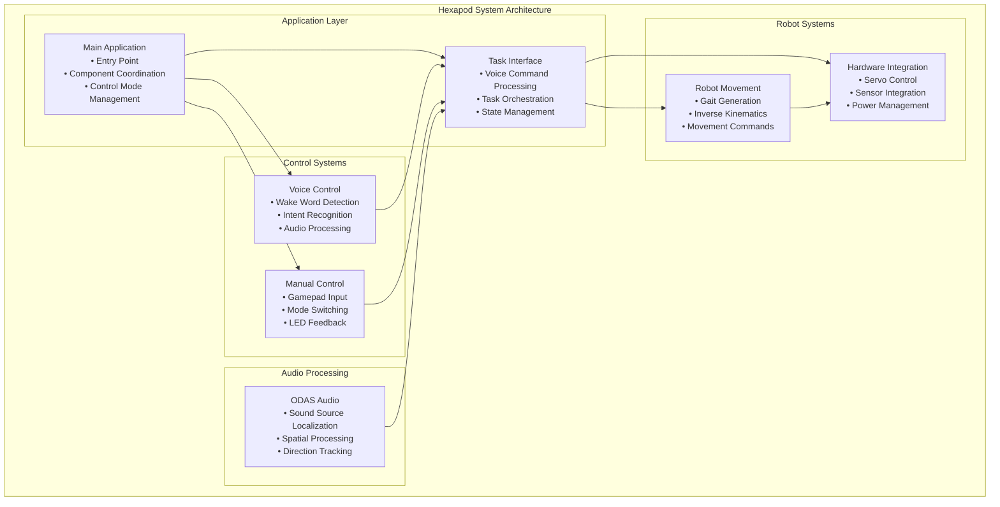
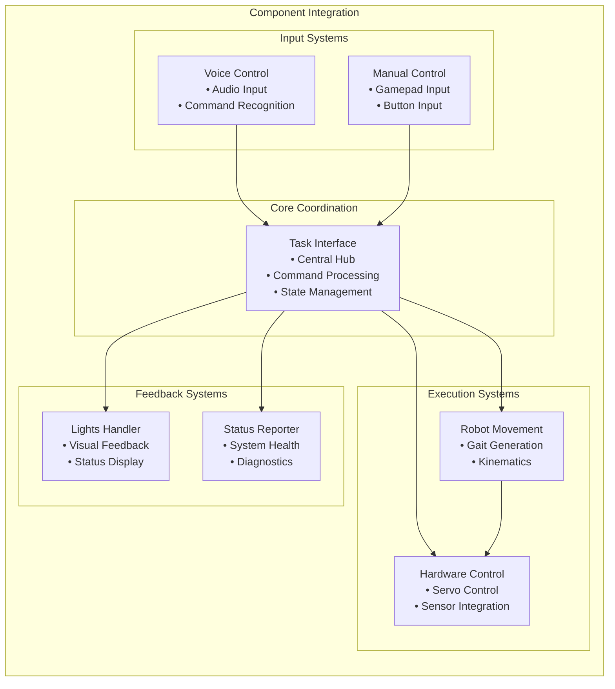
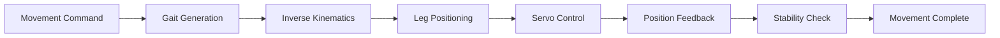
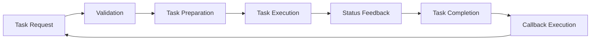

# System Overview

[← Back to Documentation](../README.md) | [Next: Main Application →](main_application.md)

## Table of Contents

- [What the System Does](#what-the-system-does)
- [Key Capabilities](#key-capabilities)
- [System Architecture](#system-architecture)
- [Hardware Components](#hardware-components)
- [Software Components](#software-components)
- [Control Modes](#control-modes)
- [Data Flow](#data-flow)

---

## What the System Does

The Hexapod System is a sophisticated, voice-controlled six-legged robot that combines advanced robotics, artificial intelligence, and real-time audio processing. The system demonstrates cutting-edge integration of multiple technologies to create an autonomous, interactive mobile platform.

The hexapod robot is designed to be an intelligent, interactive companion that can:

- **Navigate autonomously** using advanced gait generation and inverse kinematics
- **Respond to voice commands** through natural language processing and wake word detection
- **Localize sound sources** using a 6-microphone array with spatial audio processing
- **Follow targets** by combining audio localization with intelligent movement
- **Perform complex behaviors** like dancing, calibration, and maintenance routines
- **Provide visual feedback** through LED animations and status indicators
- **Operate in multiple modes** including voice control, manual control, and emergency stop

## Key Capabilities

### 1. **Voice-Controlled Operation**
- Natural speech commands like "Hey Hexapod, move forward" or "Hey Hexapod, follow me"
- Wake word detection using Picovoice Porcupine
- Intent recognition using Picovoice Rhino
- Real-time audio processing with low latency

### 2. **Intelligent Movement**
- Walk in any direction using sophisticated gait algorithms
- Execute complex movement patterns and routines
- Precise positioning using inverse kinematics

### 3. **Audio Intelligence**
- 6-microphone array for spatial audio processing
- Sound source localization using ODAS (Open embeddeD Audition System)
- Direction of arrival estimation and tracking
- Beamforming and noise reduction

### 4. **Multi-Modal Control**
- Voice commands as primary interface
- Gamepad control as secondary interface
- Button interactions for system control
- Seamless switching between control modes

### 5. **Autonomous Behaviors**
- Complex sequences like calibration, dancing, and maintenance routines
- Task-based execution system with 13 different task types
- State management and coordination
- Error handling and recovery

### 6. **Real-Time Responsiveness**
- Low-latency processing for immediate response
- Thread-based architecture for concurrent operations
- Event-driven design for responsive control
- Hardware-level timing and synchronization

## System Architecture

### High-Level System Architecture

### Component Integration

## Hardware Components

### **Robot Structure**
- **6-Legged Design**: Hexagonal body with 6 articulated legs
- **18 Servo Motors**: 3 servos per leg (coxa, femur, tibia)
- **MG-995 Servos**: High-torque servos with precise positioning
- **Pololu Maestro Controller**: 24-channel servo controller via UART

### **Sensors and Input**
- **6-Microphone Array**: Spatial audio processing and sound localization
- **ICM-20948 IMU**: 9-axis inertial measurement unit for orientation tracking
- **GPIO Button**: Physical button for system control and emergency stop
- **DualSense Controller**: Wireless gamepad for manual control

### **Visual Feedback**
- **ReSpeaker 6 LEDs**: 12 integrated APA102 LEDs for status indication and animations
- **APA102 Driver**: High-speed LED control with individual pixel addressing
- **Power Control**: GPIO-controlled LED power management

### **Power and Control**
- **5 x 1.2V 2500 mAh NiMH Battery Pack (6V total)**: Main power for servos and electronics
- **Raspberry Pi**: Main computing platform
- **Serial Communication**: UART communication with servo controller
- **GPIO Control**: Direct hardware control for sensors and LEDs

## Software Components

### **Core Application**
- **Main Application** (`main.py`): Entry point and component coordination
- **Task Interface**: Central command processing and task management
- **Configuration System**: Multi-source configuration management
- **Logging System**: Structured logging with component-specific loggers

### **Control Systems**
- **Voice Control**: Picovoice-based wake word detection and intent recognition
- **Manual Control**: Gamepad input processing and mode management
- **Button Handler**: GPIO button input with long/short press detection
- **Intent Dispatcher**: Command routing and parameter extraction

### **Robot Systems**
- **Hexapod Class**: Main robot control and movement coordination
- **Gait Generator**: Walking pattern generation (tripod, wave gaits)
- **Inverse Kinematics**: Leg position calculation for body movement
- **Calibration System**: Servo calibration and position management

### **Audio Processing**
- **ODAS Integration**: Sound source localization and spatial audio processing
- **Audio Streaming**: Real-time audio capture and playback
- **Direction Tracking**: Sound source following and tracking
- **Beamforming**: Adaptive audio beam steering

### **Task System**
- **Task Base Class**: Abstract task execution framework
- **13 Task Types**: Movement, calibration, audio, and entertainment tasks
- **Task Lifecycle**: Creation, execution, completion, and cleanup
- **Callback System**: Task completion and error handling

### **Hardware Integration**
- **Maestro UART**: Servo control and communication
- **Lights Handler**: LED control and animation management
- **IMU Integration**: Orientation tracking and sensor data
- **Sensor Management**: Multi-sensor data fusion and processing

## Control Modes

### **Voice Control Mode**
- **Primary Interface**: Natural language voice commands
- **Wake Word**: "Hey Hexapod" activation
- **Command Processing**: Intent recognition and parameter extraction
- **Task Execution**: Voice commands translated to robot actions

### **Manual Control Mode**
- **Primary Interface**: DualSense gamepad control
- **Control Modes**: Body control, gait control, voice control
- **Input Processing**: Analog stick and button input mapping
- **Mode Switching**: Seamless transitions between control modes

### **Emergency Stop**
- **PS5 Button**: Immediate system shutdown
- **Button Press**: Task interruption and system halt
- **Safety Systems**: Hardware-level safety mechanisms
- **Recovery**: Graceful system recovery and restart

### **Maintenance Mode**
- **Calibration**: Servo calibration and position management
- **Diagnostics**: System health monitoring and reporting
- **Testing**: Hardware and software validation
- **Configuration**: System parameter adjustment

## Data Flow

### **Voice Command Processing**

```mermaid
flowchart LR
    UV[User Voice] --> AC[Audio Capture]
    AC --> WWD[Wake Word Detection]
    WWD --> IR[Intent Recognition]
    IR --> ID[Intent Dispatcher]
    ID --> TC[Task Creation]
    TC --> TE[Task Execution]
    TE --> HC[Hardware Control]
    HC --> SF[Sensor Feedback]
    SF --> SU[Status Update]
```

### **Movement Control Flow**

### **Audio Processing Flow**

### **Task Execution Flow**

---

[← Back to Documentation](../README.md) | [Next: Main Application →](main_application.md)