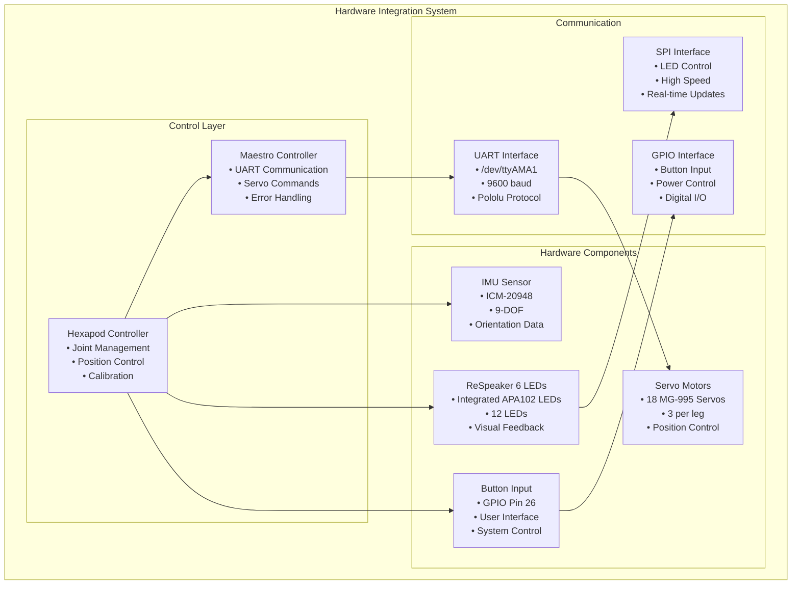
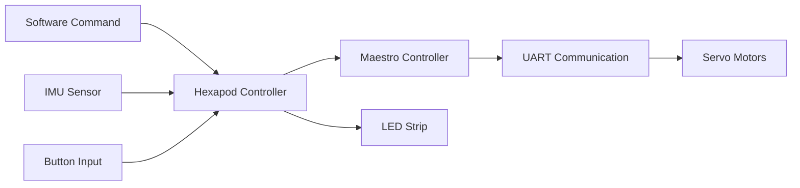

# Hardware Integration

[← Previous: Movement Commands](../robot/movement_commands.md) | [Next: IMU Data Format →](imu_data_format.md)

[← Back to Documentation](../README.md)

## Table of Contents

- [Overview](#overview)
- [System Architecture](#system-architecture)
- [Servo Control System](#servo-control-system)
- [Sensor Integration](#sensor-integration)
- [Light System](#light-system)
- [Hardware Configuration](#hardware-configuration)

---

## Overview

The Hardware Integration system provides the low-level control interface between software and physical hardware components. It manages servo control, sensor data acquisition, and visual feedback systems that enable the hexapod to move and interact with its environment.

## System Architecture

### Hardware Integration Overview

### Hardware Communication Flow

## Servo Control System

### **Maestro UART Controller** (`hexapod/maestro/maestro_uart.py`)

**Role**: Low-level servo communication using Pololu protocol
- **Communication**: UART at 9600 baud via `/dev/ttyAMA1`
- **Protocol**: Pololu serial protocol with device number 12
- **Commands**: Position, speed, acceleration, error checking
- **Thread Safety**: Thread-safe communication with locks

**Key Features**:
- **Pololu Protocol**: 0xAA start byte, device number, command byte
- **Error Handling**: Comprehensive error detection and reporting
- **Multi-servo Control**: Simultaneous control of multiple servos
- **Position Feedback**: Real-time position reading and monitoring

### **Joint Control** (`hexapod/robot/joint.py`)

**Role**: Individual servo joint management and control
- **Angle Mapping**: Converts degrees to servo target values
- **Calibration**: Individual servo calibration and limits
- **Validation**: Angle limit checking and safety validation
- **Inversion**: Support for inverted servo operation

**Key Features**:
- **Angle Validation**: Enforces joint angle limits and safety checks
- **Servo Mapping**: Maps joint angles to servo target values
- **Calibration Updates**: Dynamic calibration value updates
- **Inversion Support**: Handles inverted servo operation

### **Servo Configuration**

**Hardware Parameters**:
- **Servo Type**: MG-995 servos
- **Pulse Range**: 992-2000 microseconds (3968-8000 quarter-microseconds)
- **Channels**: 24 channels (18 used for hexapod)
- **Speed**: 32 units (0.8064us/ms)
- **Acceleration**: 5 units (0.0016128us/ms/ms)

**Channel Mapping**:
- **Coxa Joints**: Channels 0, 3, 6, 15, 18, 21
- **Femur Joints**: Channels 1, 4, 7, 16, 19, 22
- **Tibia Joints**: Channels 2, 5, 8, 17, 20, 23

## Sensor Integration

### **IMU Sensor** (`hexapod/robot/sensors/imu.py`)

**Role**: 9-DOF inertial measurement unit for orientation data
- **Sensor**: ICM-20948 9-DOF IMU
- **Data**: Acceleration, gyroscope, magnetometer, temperature
- **Integration**: Direct hardware interface via I2C

**Key Features**:
- **Acceleration Data**: X, Y, Z acceleration in g units
- **Gyroscope Data**: X, Y, Z angular velocity in degrees/second
- **Magnetometer Data**: X, Y, Z magnetic field in microteslas
- **Temperature**: Sensor temperature in Celsius

**Data Interpretation**:
- **Acceleration**: Gravity detection and orientation
- **Gyroscope**: Angular velocity and rotation detection
- **Magnetometer**: Magnetic field strength and compass heading
- **Temperature**: Thermal monitoring and calibration

### **Button Input** (`hexapod/robot/sensors/button_handler.py`)

**Role**: User input interface and system control
- **GPIO Pin**: Pin 26 (BCM numbering)
- **Functionality**: Short press, long press detection
- **Integration**: Direct GPIO interface with pull-up resistor

**Key Features**:
- **Debouncing**: Hardware and software debouncing
- **Long Press Detection**: 3-second long press threshold
- **State Management**: Button state tracking and toggling
- **External Control**: Integration with external control systems

## Light System

### **ReSpeaker 6 LED Control** (`hexapod/lights/apa102.py`)

**Role**: High-speed LED control and animation for ReSpeaker 6 integrated LEDs
- **LED Type**: APA102 (DotStar) LEDs integrated into ReSpeaker 6
- **Count**: 12 LEDs total
- **Interface**: SPI communication
- **Features**: Individual pixel control, brightness, color mixing

**Key Features**:
- **SPI Communication**: High-speed data transfer
- **Individual Control**: Per-pixel color and brightness control
- **Color Mixing**: RGB color space with brightness control
- **Animation Support**: Color wheel, rotation, and pattern effects

### **Light Management** (`hexapod/lights/lights.py`)

**Role**: High-level light control and visual feedback
- **Power Control**: GPIO pin 5 for LED power management
- **Color System**: Predefined color palette with RGB values
- **Brightness Control**: 0-100% brightness adjustment
- **Integration**: Hexapod leg-to-LED mapping

**Key Features**:
- **Color Palette**: 13 predefined colors (BLACK, BLUE, GREEN, RED, etc.)
- **Power Management**: GPIO-controlled power switching
- **Brightness Control**: Global brightness adjustment
- **Leg Mapping**: Direct mapping of legs to LED positions

**LED Mapping**:
- **Leg 0**: LED 2
- **Leg 1**: LED 0
- **Leg 2**: LED 10
- **Leg 3**: LED 8
- **Leg 4**: LED 6
- **Leg 5**: LED 4

## Hardware Configuration

### **Hexapod Configuration** (`hexapod/robot/config/hexapod_config.yaml`)

**Geometry Parameters**:
- **Hexagon Side Length**: 137.0mm
- **Coxa Length**: 27.5mm
- **Femur Length**: 52.5mm
- **Tibia Length**: 140.0mm
- **End Effector Offset**: [22.5, 80.0, -162.5] mm

**Servo Parameters**:
- **Speed**: 25% (configurable)
- **Acceleration**: 20% (configurable)
- **Angle Limits**: -45° to +45° (configurable)
- **Custom Limits**: Tibia -35° minimum

**Communication Settings**:
- **UART Port**: `/dev/ttyAMA1`
- **Baud Rate**: 9600
- **Protocol**: Pololu serial protocol

### **Calibration Data** (`hexapod/robot/config/calibration.json`)

**Servo Calibration**: Individual servo min/max values
- **Format**: JSON with leg and joint-specific values
- **Values**: Quarter-microsecond servo target values
- **Usage**: Real-time servo position mapping
- **Updates**: Dynamic calibration value updates

---

[← Previous: Movement Commands](../robot/movement_commands.md) | [Next: IMU Data Format →](imu_data_format.md)

[← Back to Documentation](../README.md)
- **Update Rate**: Real-time servo control
- **Communication Latency**: < 10ms per servo command
- **Position Accuracy**: ±1° joint angle precision
- **Simultaneous Control**: Up to 18 servos at once
- **Error Detection**: Comprehensive error reporting

### **Sensor Performance**

- **IMU Update Rate**: Real-time sensor data
- **Button Response**: < 10ms with debouncing
- **Data Accuracy**: High precision sensor readings
- **Temperature Monitoring**: Real-time thermal data

### **Light System Performance**

- **Update Rate**: Real-time LED control
- **SPI Speed**: 8MHz maximum
- **Color Accuracy**: 24-bit color depth
- **Animation Smoothness**: 60+ FPS capability

### **System Integration**

- **Thread Safety**: Safe for multi-threaded use
- **Error Handling**: Robust error recovery
- **Resource Management**: Proper hardware cleanup
- **Hardware Abstraction**: Clean interfaces for all components

### **Hardware Reliability**

- **Servo Communication**: Reliable UART communication
- **Sensor Integration**: Stable sensor data acquisition
- **Button Interface**: Robust user input handling
- **Light Control**: Consistent visual feedback

---

[← Previous: Movement Commands](../robot/movement_commands.md) | [Next: IMU Data Format →](imu_data_format.md)

[← Back to Documentation](../README.md)