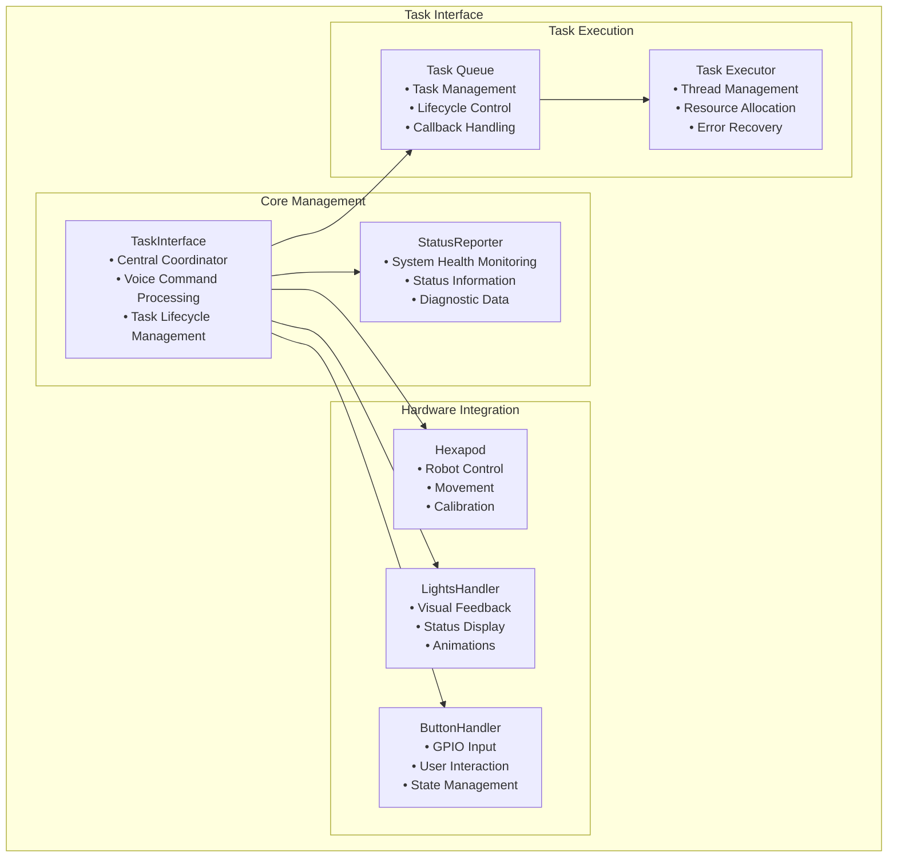
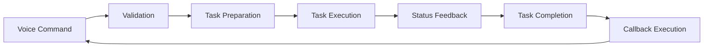

# Task Interface

[← Previous: Servo Control](../hardware/servo_control.md) | [Next: Voice Control Interface →](voice_control_interface.md)

[← Back to Documentation](../README.md)

## Table of Contents

- [Overview](#overview)
- [Architecture](#architecture)
- [Core Components](#core-components)
- [Task System](#task-system)
- [Voice Commands](#voice-commands)
- [Control Management](#control-management)
- [Status Reporting](#status-reporting)
- [Decorators](#decorators)
- [Error Handling](#error-handling)

---

## Overview

The TaskInterface is the central coordination hub for the hexapod system. It manages robot control, task execution, voice command processing, and hardware integration. The interface provides a unified API for controlling the robot through voice commands while managing complex operations like calibration, movement tasks, and audio processing.

## Architecture

### Task Interface Components

### Task Execution Flow

## Core Components

### TaskInterface Class

**Role**: Central coordination and command processing
- Manages robot control and movement
- Processes voice commands and executes tasks
- Coordinates between hardware components
- Handles task lifecycle and callbacks

**Key Features**:
- Voice command processing with decorators
- Task execution and management
- Hardware component coordination
- State management and control

### StatusReporter Class

**Role**: System health monitoring and diagnostics
- Provides comprehensive system status
- Monitors hardware and software health
- Reports calibration and movement status
- Generates diagnostic information

**Key Features**:
- Complete system status reporting
- Hardware health monitoring
- Calibration status tracking
- Movement and gait status

## Task System

### Task Base Class

All tasks inherit from the abstract `Task` class which provides:
- Thread-based execution
- Stop event management
- Callback handling
- Lifecycle management

### Available Tasks

#### Movement Tasks
- **MoveTask**: Directional movement using gait generation
- **RotateTask**: Rotation with specified angle or direction
- **MarchInPlaceTask**: In-place marching with duration control

#### Calibration Tasks
- **CompositeCalibrationTask**: Complete calibration sequence
- **MonitorCalibrationStatusTask**: Calibration monitoring
- **RunCalibrationTask**: Calibration execution

#### Audio Tasks
- **SoundSourceLocalizationTask**: Sound source tracking with ODAS
- **FollowTask**: Target following using audio localization
- **StreamODASAudioTask**: Audio streaming and playback

#### Entertainment Tasks
- **DanceTask**: Dance routine execution
- **SitUpTask**: Sit-up motion sequence
- **HelixTask**: Helical movement pattern
- **ShowOffTask**: Demonstration routine
- **SayHelloTask**: Greeting sequence

### Task Lifecycle

1. **Task Creation**: Task instance created with parameters
2. **Task Start**: Task started in separate thread
3. **Task Execution**: `execute_task()` method runs
4. **Task Completion**: Callback executed on completion
5. **Task Cleanup**: Resources freed and state reset

## Voice Commands

### System Commands

- **`hexapod_help()`**: Display context information and help
- **`system_status()`**: Comprehensive system status report
- **`shut_down()`**: Initiate shutdown sequence with cancellation
- **`wake_up()`**: Activate robot from sleep state
- **`sleep()`**: Deactivate robot and enter sleep state
- **`stop()`**: Stop all current activities

### Movement Commands

- **`move(direction, cycles, duration)`**: Move in specified direction
- **`rotate(angle, turn_direction, cycles, duration)`**: Rotate robot
- **`march_in_place(duration)`**: March in place
- **`idle_stance()`**: Return to home position

### Calibration Commands

- **`calibrate()`**: Start complete calibration process

### Audio Commands

- **`sound_source_localization()`**: Start sound source tracking
- **`follow()`**: Follow audio target
- **`stream_odas_audio(stream_type)`**: Stream ODAS audio

### Entertainment Commands

- **`dance()`**: Execute dance routine
- **`sit_up()`**: Perform sit-up motion
- **`helix()`**: Execute helix maneuver
- **`show_off()`**: Run demonstration routine
- **`say_hello()`**: Execute greeting sequence

### Light Commands

- **`turn_lights(switch_state)`**: Turn lights on/off
- **`change_color(color)`**: Change light color
- **`set_brightness(brightness_percentage)`**: Set light brightness
- **`police()`**: Police light animation
- **`rainbow()`**: Rainbow light animation

### Recording Commands

- **`start_recording(duration)`**: Start audio recording
- **`stop_recording()`**: Stop audio recording

### Utility Commands

- **`set_speed(speed_percentage)`**: Set servo speed
- **`set_accel(accel_percentage)`**: Set servo acceleration
- **`repeat_last_command()`**: Repeat last executed command

## Control Management

### Voice Control Management

- **`request_pause_voice_control()`**: Pause voice control system
- **`request_unpause_voice_control()`**: Resume voice control system
- **`request_block_voice_control_pausing()`**: Block voice control toggling
- **`request_unblock_voice_control_pausing()`**: Allow voice control toggling

### Task Management

- **`stop_task()`**: Stop currently running task
- **`set_task_complete_callback()`**: Set task completion callback
- **`_notify_task_completion()`**: Handle task completion

### External Control Management

- **`external_control_paused_event`**: Control external input during critical tasks
- **Button Handler Integration**: Coordinate with GPIO button input

## Status Reporting

### System Status Sections

1. **System Info**: Basic system information and timestamps
2. **Calibration Status**: Servo calibration data and last calibration date
3. **IMU Status**: Inertial measurement unit data and orientation
4. **Gait Status**: Current gait state and parameters
5. **Movement Status**: Current movement state and position
6. **Leg Positions**: Individual leg positions and angles

### Status Information

- **Hardware Health**: Servo status, IMU data, calibration state
- **Movement State**: Current position, gait status, movement parameters
- **System State**: Task status, voice control state, external control state
- **Performance Data**: Timing information, error counts, status history

## Decorators

### Voice Command Decorator

**`@voice_command`**: Marks methods as voice commands
- Stores last command for repetition
- Provides command logging
- Enables voice control integration

### Task Decorator

**`@task`**: Manages task lifecycle
- Ensures task attribute is set
- Automatically starts task execution
- Provides task management integration

### Injection Decorators

**`@inject_hexapod`**: Injects Hexapod instance

**`@inject_lights_handler`**: Injects LightsInteractionHandler instance

- Automatic dependency injection
- Cleaner method signatures
- Consistent component access

## Error Handling

### Task Error Handling

- **Exception Catching**: All tasks wrapped in try-catch blocks
- **Graceful Degradation**: Tasks fail safely without crashing system
- **Error Logging**: Comprehensive error logging and reporting
- **Resource Cleanup**: Proper cleanup on task failure

### System Error Handling

- **Component Failures**: Graceful handling of hardware failures
- **Task Interruption**: Safe task stopping and cleanup
- **State Recovery**: Automatic state recovery after errors
- **User Feedback**: Clear error messages and status updates

### Critical Task Handling

- **ODAS Tasks**: Special handling for audio processing tasks
- **Calibration Tasks**: Critical system calibration with error recovery
- **Shutdown Tasks**: Safe system shutdown with cancellation

---

[← Previous: Servo Control](../hardware/servo_control.md) | [Next: Voice Control Interface →](voice_control_interface.md)

[← Back to Documentation](../README.md)