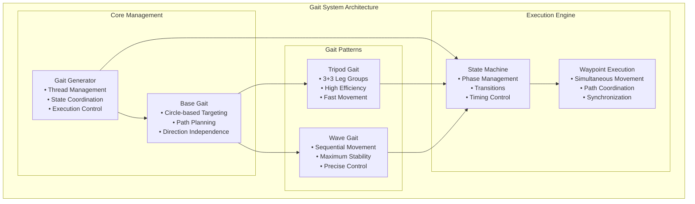
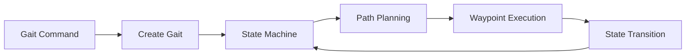

# Gait System

[← Previous: Kinematics](kinematics.md) | [Next: Movement Commands →](movement_commands.md)

[← Back to Documentation](../README.md)

## Table of Contents

- [Overview](#overview)
- [System Architecture](#system-architecture)
- [Gait Patterns](#gait-patterns)
- [Circle-Based Targeting](#circle-based-targeting)
- [State Management](#state-management)
- [Execution Engine](#execution-engine)

---

## Overview

The gait system coordinates all 6 legs to create stable, smooth walking patterns using tripod and wave gaits with sophisticated state machines for coordination. The system uses circle-based targeting for direction-independent movement and implements three-phase path planning for natural leg movement.

## System Architecture

### Gait System Components



### Gait Execution Flow



## Gait Patterns

### **Tripod Gait** (`src/gait_generator/tripod_gait.py`)

**Pattern**: 3+3 leg groups alternating movement
- **Group A**: Legs 0, 2, 4 (Right, Left Front, Left Back)
- **Group B**: Legs 1, 3, 5 (Right Front, Left, Right Back)
- **Stability**: 3 legs always supporting the robot
- **Efficiency**: Fastest and most stable gait pattern

**Key Features**:
- **Circle-based Targeting**: Direction-independent movement
- **Simultaneous Movement**: Swing and stance legs move together
- **High Stability**: Maintains support polygon throughout movement
- **Efficient Energy Use**: Optimal balance of speed and stability

### **Wave Gait** (`src/gait_generator/wave_gait.py`)

**Pattern**: Sequential leg movement (one at a time)
- **Sequence**: 0 → 1 → 2 → 3 → 4 → 5 → 0 → ...
- **Stability**: 5 legs always supporting the robot
- **Precision**: Maximum stability for delicate operations

**Key Features**:
- **Sequential Movement**: One leg moves at a time
- **Maximum Stability**: 5 legs always supporting
- **Precise Control**: Ideal for delicate operations
- **Slow but Stable**: Trade speed for maximum stability

## Circle-Based Targeting

### **Direction Independence**

The system uses circle-based targeting to make movement direction-independent:

- **Circular Workspace**: Each leg operates within a circular boundary
- **Direction Projection**: Movement direction projects legs onto circle boundaries
- **Smooth Transitions**: Natural movement in any direction
- **Mathematical Foundation**: Vector-based calculations for all operations

### **Target Calculation**

```python
def calculate_leg_target(self, leg_index: int, is_swing: bool) -> Vector3D:
    """
    Calculate target position for a leg based on movement direction.
    
    Args:
        leg_index (int): Index of the leg (0-5)
        is_swing (bool): True if leg is in swing phase, False for stance
    
    Returns:
        Vector3D: Target position in leg's local coordinate system
    """
    # Get leg's angle in the hexagon
    leg_angle = self.hexapod.leg_angles[leg_index]
    
    # Calculate target position on circle boundary
    if is_swing:
        # Swing legs move forward in movement direction
        target_2d = self.direction_vector * self.step_radius
    else:
        # Stance legs move backward (half circle) or to opposite side (full circle)
        if self.use_full_circle_stance:
            target_2d = -self.direction_vector * self.step_radius
        else:
            target_2d = Vector2D(0, 0)  # Move back to center
    
    # Convert to 3D with stance height
    target_3d = Vector3D(target_2d.x, target_2d.y, self.stance_height)
    
    return target_3d
```

### **Path Planning**

**Three-Phase Path Planning**:
1. **Lift Phase**: Swing legs lift off the ground
2. **Travel Phase**: Swing legs move to target position
3. **Lower Phase**: Swing legs lower to final position

**Stance Leg Movement**:
- **Half Circle**: Move from current position back to center (more efficient)
- **Full Circle**: Move from current position to opposite side (more movement)

## State Management

### **Gait Phases**

```python
class GaitPhase(Enum):
    """Represents different phases in a gait cycle"""
    
    # Tripod gait phases
    TRIPOD_A = auto()  # Legs 0,2,4 swing, 1,3,5 stance
    TRIPOD_B = auto()  # Legs 1,3,5 swing, 0,2,4 stance
    
    # Wave gait phases
    WAVE_1 = auto()    # Leg 0 swing (Right)
    WAVE_2 = auto()    # Leg 1 swing (Right Front)
    WAVE_3 = auto()    # Leg 2 swing (Left Front)
    WAVE_4 = auto()    # Leg 3 swing (Left)
    WAVE_5 = auto()    # Leg 4 swing (Left Back)
    WAVE_6 = auto()    # Leg 5 swing (Right Back)
```

### **Gait State**

```python
@dataclass
class GaitState:
    """Represents a state in the gait state machine"""
    
    phase: GaitPhase                    # Current phase of the gait cycle
    swing_legs: List[int]              # Legs currently in swing phase
    stance_legs: List[int]             # Legs currently in stance phase
    dwell_time: float                  # Time to spend in this state (seconds)
```

### **State Transitions**

**Tripod Gait**:
- `TRIPOD_A` → `TRIPOD_B` → `TRIPOD_A` → ...

**Wave Gait**:
- `WAVE_1` → `WAVE_2` → `WAVE_3` → `WAVE_4` → `WAVE_5` → `WAVE_6` → `WAVE_1` → ...

## Execution Engine

### **Gait Generator** (`src/gait_generator/gait_generator.py`)

**Role**: Main gait execution coordinator
- Manages gait state machine and execution
- Handles timing and synchronization
- Runs gait in separate thread for continuous movement
- Coordinates between swing and stance legs

**Key Features**:
- **Thread-based Execution**: Continuous movement without blocking
- **State Management**: Gait phase coordination and transitions
- **Timing Control**: Precise timing for smooth movement
- **Gait Switching**: Dynamic switching between gait patterns

### **Waypoint Execution**

**Simultaneous Movement**:
- All legs move simultaneously at each waypoint
- Stance legs push while swing legs execute their three-phase path
- Maximum waypoints synchronization ensures smooth coordination
- Legs that complete their paths early stay at final positions

**Path Coordination**:
- Swing legs: Lift → Travel → Lower
- Stance legs: Hold → Move → Hold
- Synchronized execution across all legs
- Smooth transitions between phases

### **Leg Path Management**

```python
@dataclass
class LegPath:
    """Represents a path for a leg movement with multiple waypoints"""
    
    waypoints: List[Vector3D]          # List of 3D positions the leg will move through
    current_waypoint_index: int = 0    # Index of the current waypoint being executed
    
    def add_waypoint(self, waypoint: Vector3D) -> None:
        """Add a waypoint to the path"""
        self.waypoints.append(waypoint)
    
    def get_current_target(self) -> Vector3D:
        """Get the current target waypoint"""
        return self.waypoints[self.current_waypoint_index]
```


---

[← Previous: Kinematics](kinematics.md) | [Next: Movement Commands →](movement_commands.md)

[← Back to Documentation](../README.md)
- **Update Rate**: 50Hz for smooth movement
- **Phase Timing**: Configurable dwell time per phase
- **Gait Switching**: < 100ms transition time
- **Thread Safety**: Safe for multi-threaded use

### **Movement Parameters**

- **Step Radius**: 30.0mm (configurable per gait)
- **Leg Lift Distance**: 20.0mm for tripod, 10.0mm for wave
- **Stance Height**: 0.0mm (configurable)
- **Dwell Time**: 0.5s (configurable per phase)

### **Stability Features**

- **Support Polygon**: Maintains stability throughout movement
- **Circle-based Targeting**: Direction-independent movement
- **Three-phase Path Planning**: Natural leg movement patterns
- **Simultaneous Execution**: Coordinated leg movement

### **System Integration**

- **Thread Management**: Separate thread for continuous movement
- **State Coordination**: Sophisticated state machine management
- **Path Planning**: Vector-based mathematical calculations
- **Hardware Interface**: Direct integration with servo control

---

[← Previous: Kinematics](kinematics.md) | [Next: Movement Commands →](movement_commands.md)

[← Back to Documentation](../README.md)