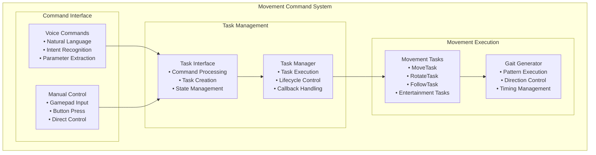
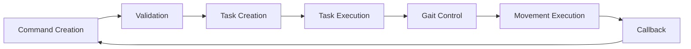

# Movement Commands

[← Previous: Gait System](gait_system.md) | [Next: Hardware Integration →](../hardware/hardware_integration.md)

[← Back to Documentation](../README.md)

## Table of Contents

- [Overview](#overview)
- [System Architecture](#system-architecture)
- [Movement Tasks](#movement-tasks)
- [Voice Commands](#voice-commands)
- [Task Execution](#task-execution)
- [Movement Coordination](#movement-coordination)

---

## Overview

The Movement Commands system provides the interface between high-level movement requests and actual robot execution. It handles everything from simple directional movement to complex tasks like following and dancing, ensuring smooth execution and safety throughout.

## System Architecture

### Movement Command Flow

### Command Processing Flow

## Movement Tasks

### **Core Movement Tasks**

#### **MoveTask** (`hexapod/task_interface/tasks/move_task.py`)

**Purpose**: Directional movement using gait generation
- **Parameters**: Direction, cycles, duration
- **Execution**: Uses tripod gait for movement
- **Features**: Configurable cycles, duration, or infinite movement

**Key Features**:
- **Direction Control**: Forward, backward, left, right movement
- **Timing Control**: Cycle-based or duration-based movement
- **Gait Integration**: Uses tripod gait for efficient movement
- **Safety**: Returns to zero position on completion

#### **RotateTask** (`hexapod/task_interface/tasks/rotate_task.py`)

**Purpose**: Rotation movement with angle or direction control
- **Parameters**: Angle, turn direction, cycles, duration
- **Execution**: Uses gait generator for rotation
- **Features**: Precise angle control or continuous rotation

#### **MarchInPlaceTask** (`hexapod/task_interface/tasks/march_in_place_task.py`)

**Purpose**: In-place marching with duration control
- **Parameters**: Duration (optional)
- **Execution**: Marching motion without forward movement
- **Features**: Configurable duration or default timing

### **Advanced Movement Tasks**

#### **FollowTask** (`hexapod/task_interface/tasks/follow_task.py`)

**Purpose**: Target following using audio localization
- **Parameters**: ODAS processor for sound source tracking
- **Execution**: Real-time direction calculation and movement
- **Features**: Audio-based target tracking and following

**Key Features**:
- **Audio Integration**: Uses ODAS for sound source localization
- **Real-time Tracking**: Continuous direction calculation
- **Gait Control**: Dynamic gait generation for following
- **External Control**: Manages external control pausing

#### **SoundSourceLocalizationTask** (`hexapod/task_interface/tasks/sound_source_localization.py`)

**Purpose**: Sound source localization without movement
- **Parameters**: ODAS processor for audio analysis
- **Execution**: Audio processing and direction detection
- **Features**: Sound source tracking and visualization

### **Entertainment Tasks**

#### **DanceTask** (`hexapod/task_interface/tasks/dance_task.py`)

**Purpose**: Dance routine execution
- **Parameters**: Lights handler for visual effects
- **Execution**: Coordinated movement sequences
- **Features**: Light synchronization and choreography

#### **SitUpTask** (`hexapod/task_interface/tasks/sit_up_task.py`)

**Purpose**: Sit-up motion sequence
- **Parameters**: Lights handler for visual feedback
- **Execution**: Sit-up movement pattern
- **Features**: Coordinated leg movement and lighting

#### **HelixTask** (`hexapod/task_interface/tasks/helix_task.py`)

**Purpose**: Helical movement pattern
- **Parameters**: Lights handler for visual effects
- **Execution**: Spiral movement sequence
- **Features**: Complex 3D movement patterns

#### **ShowOffTask** (`hexapod/task_interface/tasks/show_off_task.py`)

**Purpose**: Demonstration routine
- **Parameters**: Lights handler for visual effects
- **Execution**: Showcase movement sequence
- **Features**: Impressive movement demonstrations

#### **SayHelloTask** (`hexapod/task_interface/tasks/say_hello_task.py`)

**Purpose**: Greeting sequence
- **Parameters**: Lights handler for visual feedback
- **Execution**: Greeting movement pattern
- **Features**: Friendly interaction gestures

## Voice Commands

### **Movement Commands**

- **`move(direction, cycles, duration)`**: Move in specified direction
- **`rotate(angle, turn_direction, cycles, duration)`**: Rotate robot
- **`march_in_place(duration)`**: March in place
- **`idle_stance()`**: Return to home position

### **Advanced Commands**

- **`follow()`**: Follow audio target
- **`sound_source_localization()`**: Start sound source tracking
- **`calibrate()`**: Start calibration process

### **Entertainment Commands**

- **`dance()`**: Execute dance routine
- **`sit_up()`**: Perform sit-up motion
- **`helix()`**: Execute helix maneuver
- **`show_off()`**: Run demonstration routine
- **`say_hello()`**: Execute greeting sequence

### **Control Commands**

- **`stop()`**: Stop all current activities
- **`repeat_last_command()`**: Repeat last executed command

## Task Execution

### **Task Base Class** (`hexapod/task_interface/tasks/task.py`)

**Role**: Abstract base class for all movement tasks
- **Thread-based Execution**: Runs in separate thread
- **Lifecycle Management**: Start, execute, complete, cleanup
- **Callback System**: Task completion notifications
- **Stop Event**: Graceful task termination

**Key Features**:
- **Thread Safety**: Safe for concurrent execution
- **Error Handling**: Robust error handling and recovery
- **Resource Management**: Proper cleanup on completion
- **State Management**: Task state tracking and reporting

### **Task Lifecycle**

1. **Task Creation**: Task instance created with parameters
2. **Task Start**: Task started in separate thread
3. **Task Execution**: `execute_task()` method runs
4. **Task Completion**: Callback executed on completion
5. **Task Cleanup**: Resources freed and state reset

### **Task Management**

**Task Interface Coordination**:
- **Single Task**: Only one task active at a time
- **Task Switching**: New task stops current task
- **Task Completion**: Automatic cleanup and state reset
- **Error Recovery**: Graceful handling of task failures

## Movement Coordination

### **Gait Integration**

**Gait Generator Control**:
- **Gait Creation**: Dynamic gait creation for movement
- **Direction Setting**: Direction control for movement tasks
- **Timing Management**: Cycle and duration control
- **State Coordination**: Gait state management

**Movement Parameters**:
- **Step Radius**: 20.0mm for translation, 20.0mm for rotation
- **Leg Lift Distance**: 20.0mm for translation, 20.0mm for rotation
- **Stance Height**: 0.0mm (configurable)
- **Dwell Time**: 0.15s for translation, 0.15s for rotation

### **Hardware Coordination**

**Servo Control**:
- **Direct Control**: Individual servo control for tasks
- **Position Management**: Real-time position tracking
- **Safety Limits**: Hardware and software limits
- **Calibration**: Individual servo calibration

**Light Integration**:
- **Visual Feedback**: Task-specific light patterns
- **Status Indication**: Movement status through lights
- **Animation Control**: Coordinated light animations
- **Error Indication**: Error states through light patterns
- **Hardware Interface**: Direct servo and light control

### **Movement Capabilities**

- **Directional Movement**: Forward, backward, left, right
- **Rotation**: Angle-based or direction-based rotation
- **Following**: Audio-based target following
- **Entertainment**: Complex movement sequences
- **Calibration**: System calibration and maintenance

---

[← Previous: Gait System](gait_system.md) | [Next: Hardware Integration →](../hardware/hardware_integration.md)

[← Back to Documentation](../README.md)
