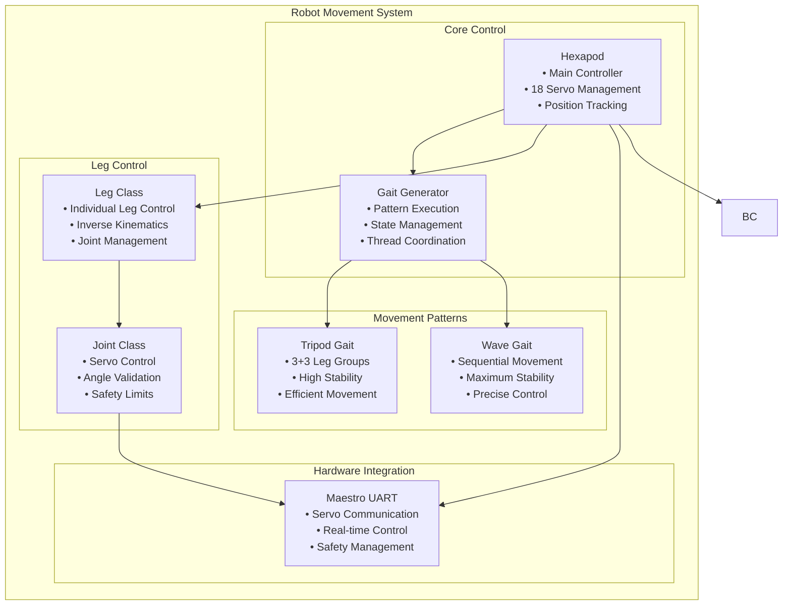

# Movement System

[← Previous: Configuration](../core/configuration.md) | [Next: Kinematics →](kinematics.md)

[← Back to Documentation](../README.md)

## Table of Contents

- [Overview](#overview)
- [System Architecture](#system-architecture)
- [Core Components](#core-components)
- [Gait System](#gait-system)
- [Movement Capabilities](#movement-capabilities)
- [Hardware Integration](#hardware-integration)

---

## Overview

The Robot Movement System is the core locomotion engine for the hexapod robot. It manages all aspects of movement from basic servo control to complex gait patterns and inverse kinematics calculations. The system provides a comprehensive framework for controlling 18 servo motors across 6 legs to achieve smooth, stable, and intelligent movement.

## System Architecture

### Movement System Components

### Movement Execution Flow

## Core Components

### 1. **Hexapod Class** (`hexapod/robot/hexapod.py`)

**Role**: Main robot controller and movement coordinator
- Manages all 18 servos across 6 legs
- Coordinates movement commands and execution
- Handles position tracking and state management
- Provides high-level movement interface

**Key Features**:
- **Servo Management**: Direct control of 18 MG-995 servos via Pololu Maestro
- **Position Tracking**: Real-time tracking of leg positions and angles
- **Movement Commands**: High-level movement interface (move_body, move_to_position)
- **Safety Systems**: Emergency stop, position validation, angle limits
- **Configuration**: YAML-based configuration for geometry and parameters

### 2. **Leg Class** (`hexapod/robot/leg.py`)

**Role**: Individual leg control and kinematics
- Manages 3 servos per leg (coxa, femur, tibia)
- Calculates inverse kinematics for foot positioning
- Handles joint angle validation and limits
- Provides leg-specific movement control

**Key Features**:
- **Inverse Kinematics**: Geometric calculations for foot positioning
- **Joint Management**: Individual servo control and validation
- **Angle Validation**: Hardware and software joint limits
- **Position Control**: Precise foot positioning in 3D space

### 3. **Joint Class** (`hexapod/robot/joint.py`)

**Role**: Individual servo control and management
- Controls servo position, speed, and acceleration
- Handles servo communication and safety limits
- Provides angle validation and error handling
- Manages servo-specific parameters

**Key Features**:
- **Servo Control**: Direct servo communication via Maestro UART
- **Angle Validation**: Hardware and software limits
- **Safety Management**: Emergency stop and position limits
- **Parameter Control**: Speed and acceleration management

### 4. **Gait Generator** (`hexapod/gait_generator/gait_generator.py`)

**Role**: Gait pattern execution and coordination
- Manages gait state machine and execution
- Coordinates leg movements and timing
- Handles continuous movement in separate thread
- Provides gait switching and parameter control

**Key Features**:
- **Thread-based Execution**: Continuous movement without blocking
- **State Management**: Gait phase coordination and transitions
- **Timing Control**: Precise timing for smooth movement
- **Gait Switching**: Dynamic switching between gait patterns

## Gait System

### **Tripod Gait** (`hexapod/gait_generator/tripod_gait.py`)

**Pattern**: 3+3 leg groups alternating movement
- **Group A**: Legs 0, 2, 4 (Right, Left Front, Left Back)
- **Group B**: Legs 1, 3, 5 (Right Front, Left, Right Back)
- **Stability**: 3 legs always supporting the robot
- **Efficiency**: Fastest and most stable gait pattern

**Key Features**:
- **Circle-based Targeting**: Direction-independent movement
- **Simultaneous Movement**: Swing and stance legs move together
- **Stability**: Maintains support polygon throughout movement
- **Efficiency**: Optimal balance of speed and stability

### **Wave Gait** (`hexapod/gait_generator/wave_gait.py`)

**Pattern**: Sequential leg movement (one at a time)
- **Sequence**: 0 → 1 → 2 → 3 → 4 → 5 → 0 → ...
- **Stability**: 5 legs always supporting the robot
- **Precision**: Maximum stability for precise movements

**Key Features**:
- **Sequential Movement**: One leg moves at a time
- **Maximum Stability**: 5 legs always supporting
- **Precise Control**: Ideal for delicate operations
- **Slow but Stable**: Trade speed for maximum stability

### **Base Gait System** (`hexapod/gait_generator/base_gait.py`)

**Role**: Abstract base class for all gait patterns
- **Circle-based Targeting**: Direction-independent movement
- **Three-phase Path Planning**: Lift → Travel → Lower for swing legs
- **Vector Mathematics**: Clean mathematical operations
- **Extensible Design**: Easy to add new gait patterns

**Key Features**:
- **Direction Independence**: Same gait works for any movement direction
- **Path Planning**: Smooth trajectories with waypoints
- **Mathematical Foundation**: Vector-based calculations
- **Extensibility**: Easy to implement new gait patterns

## Movement Capabilities

### **Basic Movements**

- **Standing**: Stable standing position with all legs supporting
- **Walking**: Forward, backward, left, right with various gaits
- **Turning**: Smooth turning with different radius options
- **Positioning**: Move to specific coordinates or orientations

### **Advanced Movements**

- **Body Movement**: Translation and rotation of the robot body
- **Leg Positioning**: Individual leg control and positioning
- **Predefined Positions**: Zero, high profile, low profile positions
- **Gait Switching**: Dynamic switching between gait patterns

### **Movement Commands**

- **`move_body(tx, ty, tz, roll, pitch, yaw)`**: Body translation and rotation
- **`move_to_position(position)`**: Move to predefined positions
- **`move_all_legs(positions)`**: Move all legs to specific positions
- **`move_leg_angles(leg, coxa, femur, tibia)`**: Direct leg angle control

## Hardware Integration

### **Servo Control**

- **18 MG-995 Servos**: High-torque servos with precise positioning
- **Pololu Maestro Controller**: 24-channel servo controller via UART
- **Real-time Control**: 50Hz update rate for smooth movement
- **Safety Management**: Emergency stop and position limits

### **Sensor Integration**

- **ICM-20948 IMU**: 9-axis inertial measurement unit
- **Position Feedback**: Real-time position and angle tracking
- **Safety Monitoring**: Continuous stability assessment

### **Communication**

- **UART Communication**: Serial communication with servo controller
- **Thread Safety**: Thread-safe servo control and updates
- **Error Handling**: Robust error handling and recovery
- **Status Monitoring**: Real-time status and error reporting

[← Previous: Configuration](../core/configuration.md) | [Next: Kinematics →](kinematics.md)

[← Back to Documentation](../README.md)