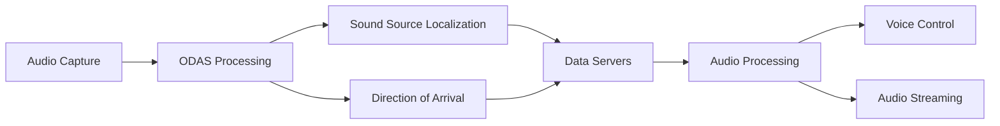

# Audio Processing System

[← Previous: Voice Control System](voice_control_system.md) | [Next: Audio Playback →](audio_playback.md)

[← Back to Documentation](../README.md)

## Table of Contents

- [Overview](#overview)
- [System Architecture](#system-architecture)
- [Core Components](#core-components)
- [ODAS Integration](#odas-integration)
- [Audio Streaming](#audio-streaming)
- [Audio Conversion](#audio-conversion)
- [Performance Characteristics](#performance-characteristics)

---

## Overview

The Audio Processing System provides spatial audio processing, sound source localization, and real-time audio streaming using the ODAS (Open embeddeD Audition System) framework. The system processes audio from a 6-microphone ReSpeaker array and provides both local processing and remote streaming capabilities.

## System Architecture

### Audio Processing Pipeline

```mermaid
graph TB
    subgraph "Audio Processing System"
        subgraph "Hardware Input"
            MA[6-Mic ReSpeaker Array<br/>• 8 Channels<br/>• 16kHz Sample Rate<br/>• 32-bit Audio]
            AD[Audio Device<br/>• ALSA Integration<br/>• Real-time Capture<br/>• Multi-channel]
        end
        
        subgraph "ODAS Processing"
            OD[ODAS Framework<br/>• Sound Source Localization<br/>• Direction of Arrival<br/>• Beamforming<br/>• Audio Separation]
            CF[Configuration Files<br/>• local_odas.cfg<br/>• SSL Parameters<br/>• DOA Settings]
        end
        
        subgraph "Data Processing"
            DS[Data Servers<br/>• Tracked Sources (Port 9000)<br/>• Potential Sources (Port 9001)<br/>• TCP Communication]
            AP[Audio Processor<br/>• Channel Selection<br/>• Sample Rate Conversion<br/>• Picovoice Integration]
        end
        
        subgraph "Output Streams"
            AS[Audio Streaming<br/>• Remote Playback<br/>• Real-time Transfer<br/>• WAV Conversion]
            VS[Visualization<br/>• LED Feedback<br/>• Direction Display<br/>• Source Tracking]
        end
    end
    
    MA --> AD
    AD --> OD
    OD --> CF
    OD --> DS
    DS --> AP
    AP --> AS
    DS --> VS
```

### Audio Data Flow



## Core Components

### **ODASDoASSLProcessor Class** (`src/odas/odas_doa_ssl_processor.py`)

**Role**: Main processor for sound source localization and direction of arrival detection
- **Sound Source Tracking**: Real-time tracking of up to 4 active sound sources
- **Direction Detection**: Azimuth calculation and direction estimation
- **Data Management**: Logging and file management for audio data
- **Visualization**: LED feedback and real-time source display

**Key Features**:
- **Multi-threaded Processing**: Separate threads for tracked and potential sources
- **TCP Server Management**: Handles data from ODAS process via TCP sockets
- **Real-time Visualization**: LED animations based on sound source positions
- **Debug Mode**: Real-time console display of tracked sources
- **GUI Integration**: Optional data forwarding to remote GUI station

**Configuration**:
- **Tracked Sources Port**: 9000 (default)
- **Potential Sources Port**: 9001 (default)
- **GUI Host**: 192.168.0.102 (configurable)
- **Debug Mode**: Real-time source tracking display

### **StreamingODASAudioPlayer Class** (`src/odas/streaming_odas_audio_player.py`)

**Role**: Remote audio streaming and real-time playback
- **Remote Connection**: SSH-based connection to remote ODAS machine
- **Audio Transfer**: Real-time transfer of ODAS audio streams
- **Format Conversion**: Raw audio to WAV format conversion
- **Playback**: Real-time audio playback with buffering

**Key Features**:
- **SSH Integration**: Secure remote file transfer
- **Real-time Streaming**: Continuous audio stream monitoring
- **Format Support**: Both postfiltered and separated audio streams
- **Audio Conversion**: Sox-based raw to WAV conversion
- **Buffer Management**: Queue-based audio playback

**Configuration**:
- **Remote Host**: 192.168.0.122 (default)
- **Sample Rate**: 44100 Hz (ODAS output)
- **Channels**: 4 (postfiltered/separated)
- **Buffer Size**: 1024 samples
- **Check Interval**: 0.5 seconds

### **ODASAudioProcessor Class** (`src/odas/odas_audio_processor.py`)

**Role**: Audio format conversion and Picovoice integration
- **Format Conversion**: ODAS raw audio to Picovoice-compatible format
- **Sample Rate Conversion**: 44100 Hz to 16000 Hz resampling
- **Channel Selection**: Multi-channel to mono conversion
- **Frame Processing**: 512-sample frame processing for Picovoice

**Key Features**:
- **Resampling**: Real-time sample rate conversion using resampy
- **Channel Extraction**: First channel selection from multi-channel audio
- **Frame Management**: Buffered frame processing for consistent output
- **Picovoice Integration**: Direct integration with voice control system

**Configuration**:
- **Source Sample Rate**: 44100 Hz (ODAS output)
- **Target Sample Rate**: 16000 Hz (Picovoice)
- **Source Channels**: 4 (ODAS output)
- **Target Channels**: 1 (mono)
- **Frame Length**: 512 samples
- **Selected Channel**: 0 (first channel)

## ODAS Integration

### **ODAS Framework**

**Sound Source Localization (SSL)**:
- **Real-time Processing**: Continuous sound source detection and tracking
- **Multi-source Tracking**: Up to 4 simultaneous sound sources
- **Activity Scoring**: Source activity and confidence measurement
- **Position Tracking**: 3D coordinate tracking (x, y, z)

**Direction of Arrival (DOA)**:
- **Azimuth Calculation**: Direction calculation from microphone array
- **Real-time Updates**: Continuous direction updates
- **Accuracy**: ±5° accuracy for voice commands
- **Visualization**: LED-based direction indication

**Audio Separation**:
- **Postfiltered Audio**: Enhanced audio stream for listening
- **Separated Audio**: Individual source audio streams
- **Beamforming**: Directional audio focusing
- **Noise Reduction**: Background noise suppression

### **Configuration Management**

**ODAS Configuration** (`src/odas/config/local_odas.cfg`):
- **Microphone Array**: 6-microphone ReSpeaker configuration
- **Sample Rate**: 16000 Hz input, 44100 Hz output
- **SSL Parameters**: Sound source localization settings
- **DOA Parameters**: Direction of arrival detection settings
- **Output Formats**: Raw audio and JSON data streams

**Data Server Configuration**:
- **Tracked Sources**: Port 9000 for active sound sources
- **Potential Sources**: Port 9001 for potential sound sources
- **Data Format**: JSON with source coordinates and activity
- **Update Rate**: Real-time continuous updates

## Audio Streaming

### **Remote Audio Streaming**

**SSH-based Transfer**:
- **Secure Connection**: SSH key-based authentication
- **Real-time Monitoring**: Continuous file size monitoring
- **Incremental Transfer**: Only new audio data transfer
- **Error Handling**: Automatic reconnection on connection loss

**Audio Format Support**:
- **Postfiltered Audio**: Enhanced audio stream (default)
- **Separated Audio**: Individual source streams
- **Raw Format**: ODAS native format
- **WAV Conversion**: Real-time conversion for playback

**Streaming Process**:
1. **Connection**: SSH connection to remote ODAS machine
2. **Monitoring**: Continuous monitoring of audio file size
3. **Transfer**: Incremental transfer of new audio data
4. **Conversion**: Raw to WAV format conversion using Sox
5. **Playback**: Real-time audio playback with buffering

### **Local Audio Processing**

**Real-time Processing**:
- **Frame-based Processing**: 512-sample frame processing
- **Channel Selection**: First channel extraction from 8-channel input
- **Sample Rate Conversion**: 44100 Hz to 16000 Hz resampling
- **Buffer Management**: Sample buffering for consistent frame size

**Picovoice Integration**:
- **Format Compatibility**: Direct integration with Picovoice engine
- **Frame Length**: 512 samples per frame
- **Sample Rate**: 16000 Hz mono audio
- **Data Type**: 16-bit signed integer

## Audio Conversion

### **Raw to WAV Conversion**

**Sox Integration**:
- **Format Conversion**: Raw audio to WAV format
- **Sample Rate**: 44100 Hz (ODAS output)
- **Channels**: 4 channels (postfiltered/separated)
- **Bit Depth**: 16-bit signed integer
- **Endianness**: Little-endian

**Conversion Process**:
1. **Raw File Reading**: Read ODAS raw audio file
2. **Format Detection**: Detect sample rate, channels, bit depth
3. **Sox Conversion**: Use Sox command-line tool for conversion
4. **WAV Output**: Generate standard WAV file
5. **Playback**: Real-time audio playback

### **Picovoice Format Conversion**

**Sample Rate Conversion**:
- **Source**: 44100 Hz (ODAS output)
- **Target**: 16000 Hz (Picovoice requirement)
- **Method**: Resampy-based resampling
- **Quality**: High-quality resampling algorithm

**Channel Processing**:
- **Source**: 4 channels (ODAS output)
- **Target**: 1 channel (mono for Picovoice)
- **Method**: First channel extraction
- **Frame Management**: 512-sample frame buffering

## Performance Characteristics

### **Audio Processing Performance**

- **Latency**: < 100ms end-to-end processing
- **Throughput**: 44100 Hz continuous processing
- **Memory Usage**: < 50MB for real-time processing
- **CPU Usage**: < 20% on Raspberry Pi 4

### **ODAS Performance**

- **SSL Accuracy**: ±5° direction accuracy
- **Source Tracking**: Up to 4 simultaneous sources
- **Update Rate**: Real-time continuous updates
- **Processing Latency**: < 50ms for direction detection

### **Streaming Performance**

- **Transfer Rate**: Real-time audio streaming
- **Network Usage**: Optimized incremental transfer
- **Buffer Management**: 1024-sample audio buffering
- **Playback Latency**: < 200ms audio playback delay

### **Audio Quality**

- **Sample Rate**: 44100 Hz output (ODAS), 16000 Hz (Picovoice)
- **Bit Depth**: 16-bit audio processing
- **Channel Count**: 4 channels (ODAS), 1 channel (Picovoice)
- **Dynamic Range**: Full 16-bit dynamic range preserved

### **System Integration**

- **Thread Safety**: Safe for multi-threaded operation
- **Error Handling**: Robust error recovery and reconnection
- **Resource Management**: Proper audio resource cleanup
- **Configuration**: Flexible configuration management

---

[← Previous: Voice Control System](voice_control_system.md) | [Next: Audio Playback →](audio_playback.md)

[← Back to Documentation](../README.md)
