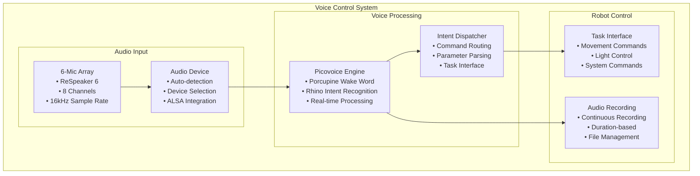

# Voice Control System

[← Previous: Gamepad Controller](../interface/gamepad_controller.md) | [Next: Audio Recording →](audio_recording.md)

[← Back to Documentation](../README.md)

## Table of Contents

- [Overview](#overview)
- [System Architecture](#system-architecture)
- [Core Components](#core-components)
- [Voice Commands](#voice-commands)
- [ODAS Audio Processing System](#odas-audio-processing-system)

---

## Overview

The Voice Control System provides natural language control of the hexapod robot using Picovoice's Porcupine for wake word detection and Rhino for intent recognition. The system processes voice commands through a 6-microphone array and executes corresponding robot actions.

## System Architecture

### Voice Control Flow

### Voice Processing Pipeline

## Core Components

### **VoiceControl Class** (`src/kws/voice_control.py`)

**Role**: Main voice control thread and audio processing coordinator
- **Thread-based Execution**: Runs in separate daemon thread
- **ODAS Audio Processing System**: Real-time audio capture and processing
- **Picovoice Integration**: Wake word detection and intent recognition
- **Task Management**: Command execution through task interface

**Key Features**:
- **Multi-threaded Architecture**: Separate audio processing thread
- **Pause/Resume Support**: Dynamic voice control pausing
- **Audio Recording**: Integrated audio recording capabilities
- **Device Auto-detection**: Automatic ReSpeaker 6 detection
- **Error Handling**: Robust error recovery and logging

**Configuration**:
- **Sample Rate**: 16kHz for optimal recognition
- **Channels**: 8 channels (ReSpeaker 6), first channel used for Picovoice
- **Chunk Size**: 512 frames per buffer
- **Sensitivity**: Porcupine 0.75, Rhino 0.25 (configurable)

### **IntentDispatcher Class** (`src/kws/intent_dispatcher.py`)

**Role**: Command routing and parameter parsing
- **Intent Mapping**: Maps recognized intents to handler methods
- **Parameter Parsing**: Converts voice parameters to function arguments
- **Validation**: Validates command parameters and constraints
- **Error Handling**: Graceful handling of invalid commands

**Key Features**:
- **Handler Decorator**: Clean intent handler registration
- **Parameter Conversion**: Natural language to programmatic parameters
- **Duration Parsing**: Time unit conversion (seconds, minutes, hours)
- **Angle Parsing**: Word-to-number conversion for rotation angles
- **Percentage Parsing**: Percentage string to numeric conversion

### **Recorder Class** (`src/kws/recorder.py`)

**Role**: Audio recording and file management
- **Continuous Recording**: Long-duration recording with automatic file splitting
- **Duration-based Recording**: Timed recording with automatic stop
- **File Management**: Organized audio file storage and naming
- **Format Support**: WAV format with 16kHz, 8-channel audio

**Key Features**:
- **Auto-splitting**: 30-minute audio record splitting for continuous recording
- **Timer Support**: Automatic recording stop after specified duration
- **File Organization**: Timestamped filenames and organized storage
- **Status Tracking**: Real-time recording status and statistics

## Voice Commands

### **System Commands**

- **`help`**: Display system help and available commands
- **`system_status`**: Show current system status and robot state
- **`shut_down`**: Shutdown the robot system
- **`wake_up`**: Wake up the robot from sleep mode
- **`sleep`**: Put the robot into sleep mode
- **`calibrate`**: Start robot calibration process
- **`repeat`**: Repeat the last executed command

### **Movement Commands**

- **`move`**: Move in specified direction with optional cycles/duration
  - Parameters: `move_direction`, `move_cycles`, `move_time`, `time_unit`
  - Directions: forward, backward, left, right
- **`rotate`**: Rotate robot with angle, cycles, or duration
  - Parameters: `turn_direction`, `rotate_angle`, `rotate_cycles`, `rotate_time`, `time_unit`
  - Directions: left, right, clockwise, counterclockwise
- **`march_in_place`**: March in place with optional duration
  - Parameters: `march_time`, `time_unit`
- **`idle_stance`**: Return to idle/home position
- **`stop`**: Stop all current movement

### **Advanced Commands**

- **`follow`**: Follow audio target using sound source localization
- **`sound_source_localization`**: Start sound source tracking without movement
- **`stream_odas_audio`**: Stream ODAS audio with specified type
  - Parameters: `odas_stream_type` (separated, postfiltered)

### **Light Control Commands**

- **`turn_lights`**: Turn lights on/off
  - Parameters: `switch_state` (on, off)
- **`change_color`**: Change LED color
  - Parameters: `color` (red, blue, green, etc.)
- **`set_brightness`**: Set LED brightness
  - Parameters: `brightness_percentage` (0-100%)
- **`police`**: Police light animation
- **`rainbow`**: Rainbow light animation

### **Entertainment Commands**

- **`sit_up`**: Perform sit-up motion
- **`helix`**: Perform helix maneuver
- **`show_off`**: Run demonstration routine
- **`hello`**: Execute greeting sequence

### **Recording Commands**

- **`start_recording`**: Start audio recording
  - Parameters: `record_time`, `time_unit` (optional duration)
- **`stop_recording`**: Stop current recording

### **System Configuration Commands**

- **`set_speed`**: Set robot movement speed
  - Parameters: `speed_percentage` (0-100%)
- **`set_accel`**: Set robot acceleration
  - Parameters: `accel_percentage` (0-100%)

## ODAS Audio Processing System

### **Audio Capture**

**Hardware Integration**:
- **ReSpeaker 6**: 6-microphone array with 8-channel output
- **Sample Rate**: 16kHz for optimal voice recognition
- **Channels**: 8 channels, first channel used for Picovoice
- **Format**: 16-bit signed integer (paInt16)

**Device Management**:
- **Auto-detection**: Automatic ReSpeaker 6 device detection
- **Device Selection**: Configurable audio device selection
- **ALSA Integration**: Direct ALSA audio interface
- **Error Handling**: Graceful fallback to default device

### **ODAS Audio Processing System Pipeline**

**Real-time Processing**:
- **Frame Processing**: 512-frame audio buffer processing
- **Channel Extraction**: First channel extraction for Picovoice
- **Data Conversion**: Raw audio to numpy array conversion
- **Picovoice Integration**: Direct audio data processing

**Audio Recording**:
- **Continuous Recording**: Long-duration recording with auto-splitting
- **Duration Recording**: Timed recording with automatic stop
- **File Management**: Organized audio file storage
- **Format Support**: WAV format with proper headers

### **Wake Word Detection**

**Porcupine Integration**:
- **Wake Word**: "Hey Hexapod" (custom trained)
- **Sensitivity**: 0.75 (configurable)
- **Real-time Processing**: Continuous audio monitoring
- **Callback System**: Asynchronous wake word detection

**Wake Word Response**:
- **Visual Feedback**: Light indication of wake word detection
- **Task Interruption**: Automatic interruption of current tasks
- **State Management**: Transition to intent listening mode

### **Intent Recognition**

**Rhino Integration**:
- **Context File**: Custom hexapod context for intent recognition
- **Sensitivity**: 0.25 (configurable)
- **Slot Extraction**: Parameter extraction from voice commands
- **Confidence Scoring**: Intent confidence and validation

**Intent Processing**:
- **Parameter Parsing**: Natural language to programmatic parameters
- **Validation**: Command parameter validation and error handling
- **Dispatch**: Intent routing to appropriate handlers
- **Feedback**: Visual and audio feedback for command execution
- **Resource Management**: Proper audio resource cleanup

### **Recording Performance**

- **Continuous Recording**: 30-minute audio record splitting
- **File Management**: Organized audio file storage
- **Format Support**: WAV format with proper headers
- **Storage Efficiency**: Optimized file size and organization

### **Command Recognition**

- **Intent Accuracy**: High accuracy for trained commands
- **Parameter Parsing**: Robust parameter extraction and validation
- **Error Handling**: Graceful handling of invalid commands
- **Feedback System**: Clear visual and audio feedback

---

[← Previous: Gamepad Controller](../interface/gamepad_controller.md) | [Next: Audio Recording →](audio_recording.md)

[← Back to Documentation](../README.md)
